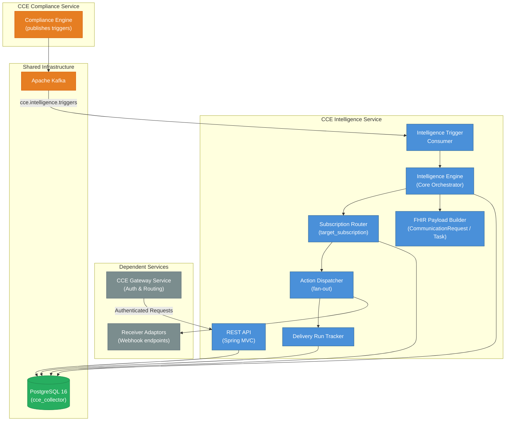
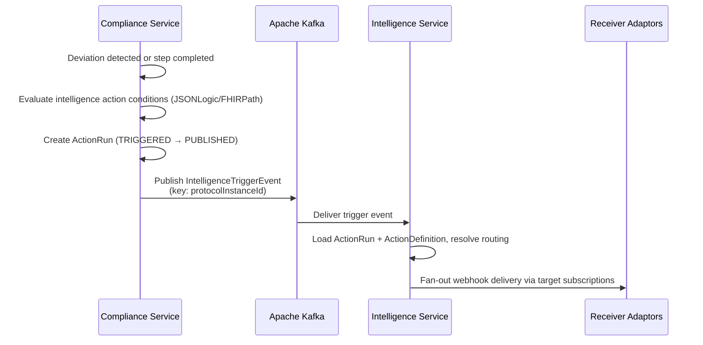
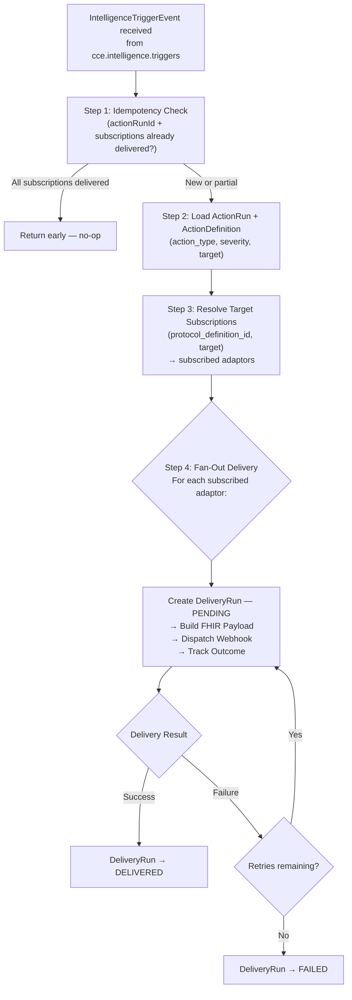
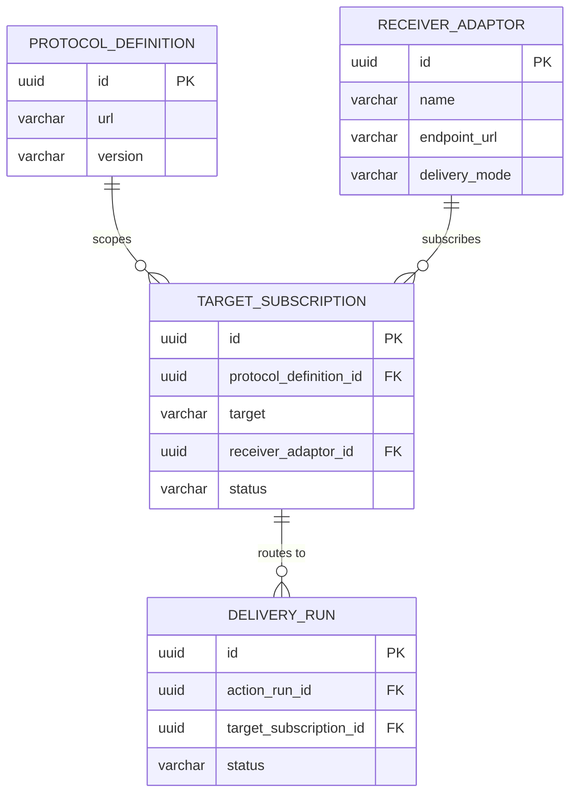
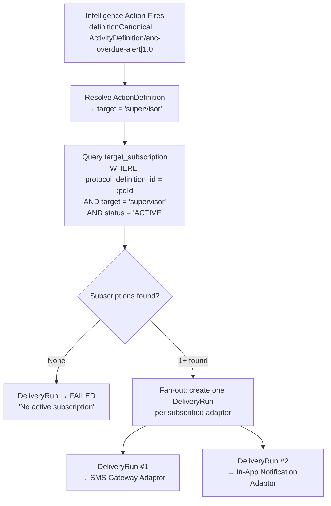
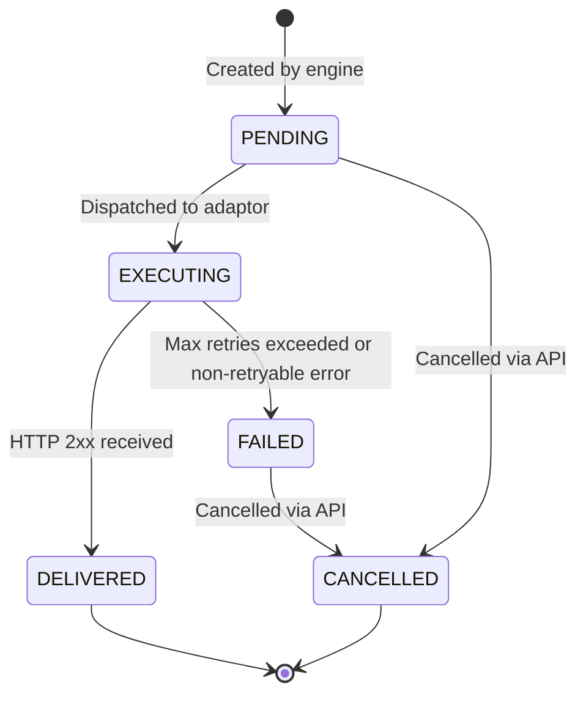

# Architecture & Design

## 1. System Context

The **CCE Intelligence Service** is the delivery engine of the CCE platform. It consumes intelligence trigger events published by the Compliance Service via Kafka, resolves routing via a many-to-many **target subscription** model, builds FHIR-compliant payloads, and delivers actions to registered **Receiver Adaptors** via webhook.

> All REST requests arrive via the **CCE Gateway Service**, which validates OAuth tokens and enforces scopes (`delivery-runs:read|write`, `target-subscriptions:read|write`, `admin`). The Intelligence Service does not handle authentication or authorization.



**This service does NOT handle:** event ingestion (Collector), protocol matching (Compliance), time-based transitions (Scheduler), analytics dashboards (Insights), or authentication/authorization (Gateway).

---

## 1.1 Compliance Service Contract

The **CCE Compliance Service** (v1.1.0+) is the upstream publisher. When a step deviation is detected (OVERDUE/MISSED) or a step is completed with certain conditions, the Compliance Service's `IntelligenceActionEvaluator` evaluates PlanDefinition intelligence actions, creates `ActionRun` records (TRIGGERED → PUBLISHED), and publishes `IntelligenceTriggerEvent` messages to `cce.intelligence.triggers`.



#### Ownership Boundaries

| Aspect | Owner | Details |
|---|---|---|
| **Intelligence action evaluation** | Compliance Service | Evaluates PlanDefinition conditions, publishes triggers to Kafka |
| **`action_definition` table** | Compliance Service | FHIR ActivityDefinition resources (message templates, action type, severity, target) |
| **`action_run` table** | Compliance Service | Tracks trigger lifecycle (TRIGGERED → PUBLISHED) |
| **`action_run_context` table** | Compliance Service | Evaluation context (why an action fired) — available as read-only |
| **Trigger consumption & routing** | Intelligence Service | Consumes triggers, resolves target subscriptions, fan-out delivery |
| **`receiver_adaptor` table** | Intelligence Service | Registered webhook endpoints |
| **`target_subscription` table** | Intelligence Service | Many-to-many routing map (protocol × target → adaptors) |
| **`delivery_run` table** | Intelligence Service | Delivery lifecycle per (action_run × adaptor); FK to `action_run.id` |
| **`delivery_audit_log` table** | Intelligence Service | Audit trail for delivery operations |

> **Key invariant:** The Compliance Service evaluates *when* to act and *what* action to take. The Intelligence Service decides *where* to deliver it (routing via target subscriptions) and *how* (webhook to receiver adaptors). This separation allows routing to evolve independently of clinical logic.

---

## 2. Technology Stack

| Concern | Technology | Version |
|---------|------------|---------|
| Language | Java | 21 (LTS) |
| Framework | Spring Boot | 3.4.x |
| Build tool | Gradle | 8.x |
| Database | PostgreSQL | 16+ (shared `cce_collector` database) |
| Message broker | Apache Kafka | 3.7+ (KRaft mode) |
| DB access | Spring Data JPA + Hibernate | (Spring Boot managed) |
| DB migration | Flyway | (Spring Boot managed) |
| Connection pool | HikariCP | (Spring Boot default) |
| Expression evaluation | ~~Apache Johnzon JsonLogic~~ | ~~2.0.2~~ | *Removed — evaluation handled by Compliance Service* |
| HTTP client | Spring WebClient (reactive, non-blocking) | (Spring Boot managed) |
| Observability | Micrometer + Prometheus | (Spring Boot managed) |
| Testing | JUnit 5, Testcontainers, MockMvc | |

### Key Gradle Dependencies

```groovy
// Spring Boot starters
implementation 'org.springframework.boot:spring-boot-starter-web'
implementation 'org.springframework.boot:spring-boot-starter-data-jpa'
implementation 'org.springframework.boot:spring-boot-starter-actuator'
implementation 'org.springframework.boot:spring-boot-starter-validation'
implementation 'org.springframework.boot:spring-boot-starter-webflux'  // WebClient for webhook delivery
implementation 'org.springframework.kafka:spring-kafka'

// Database
runtimeOnly 'org.postgresql:postgresql'
implementation 'org.flywaydb:flyway-core'
implementation 'org.flywaydb:flyway-database-postgresql'

// Expression evaluation — removed (evaluation handled by Compliance Service)
// implementation 'org.apache.johnzon:johnzon-jsonlogic:2.0.2'

// Observability
implementation 'io.micrometer:micrometer-registry-prometheus'

// Testing
testImplementation 'org.springframework.boot:spring-boot-starter-test'
testImplementation 'org.springframework.kafka:spring-kafka-test'
testImplementation 'org.testcontainers:postgresql'
testImplementation 'org.testcontainers:kafka'
testImplementation 'org.testcontainers:junit-jupiter'
testImplementation 'com.squareup.okhttp3:mockwebserver'  // Mock webhook endpoints
```

**Not included:** HAPI FHIR (FHIR payloads are hand-built as JSONB — no FHIR R4 runtime), Redis (no caching in 1.0.0).

---

## 3. Package Structure

```
src/main/java/org/openphc/cce/intelligence/
├── IntelligenceServiceApplication.java           # @SpringBootApplication
├── config/
│   ├── KafkaConsumerConfig.java                   # Consumer factory, error handler, DLQ
│   ├── WebClientConfig.java                       # WebClient for webhook delivery
│   ├── JpaConfig.java                             # JPA/Hibernate settings
│   ├── AsyncConfig.java                           # @EnableAsync for audit writes
│   └── ObservabilityConfig.java                   # Custom metrics
├── domain/
│   ├── entity/
│   │   ├── DeliveryRun.java                       # Delivery lifecycle per (action_run × adaptor)
│   │   ├── ReceiverAdaptor.java                   # Registered webhook endpoint
│   │   ├── TargetSubscription.java                # Many-to-many routing map
│   │   └── DeliveryAuditLog.java                  # Audit trail entry
│   ├── readonly/
│   │   ├── ActionDefinition.java                  # Read-only (@Immutable) — compliance-owned
│   │   └── ActionRun.java                         # Read-only (@Immutable) — FK anchor for delivery_run
│   ├── enums/
│   │   ├── DeliveryRunStatus.java                 # PENDING, EXECUTING, DELIVERED, FAILED, CANCELLED
│   │   ├── ActionType.java                        # NOTIFICATION, ESCALATION, COORDINATION
│   │   ├── DeliveryMode.java                      # WEBHOOK (1.0.0); TOPIC_SUBSCRIPTION (future)
│   │   └── IntelligenceSeverity.java              # LOW, MEDIUM, HIGH, CRITICAL
│   └── repository/
│       ├── DeliveryRunRepository.java
│       ├── ReceiverAdaptorRepository.java
│       ├── TargetSubscriptionRepository.java
│       ├── DeliveryAuditLogRepository.java
│       ├── ActionDefinitionRepository.java        # Read-only
│       └── ActionRunRepository.java               # Read-only — lookup by id for delivery anchoring
├── engine/
│   ├── IntelligenceEngine.java                    # Core orchestrator — trigger → build payload → route → deliver
│   ├── FhirPayloadBuilder.java                    # Builds FHIR CommunicationRequest or Task from trigger + ActionDefinition
│   ├── SubscriptionRouter.java                    # Resolve (protocol_definition_id, target) → List<ReceiverAdaptor>
│   └── ActionDispatcher.java                      # Fan-out webhook delivery to subscribed adaptors
├── kafka/
│   ├── config/                                    # Consumer factory, topic bindings
│   ├── consumer/
│   │   └── IntelligenceTriggerConsumer.java       # @KafkaListener for cce.intelligence.triggers
│   └── model/
│       └── IntelligenceTriggerEvent.java          # Inbound Kafka message record
├── service/
│   ├── DeliveryRunService.java                    # Delivery run lifecycle management
│   ├── ReceiverAdaptorService.java                # Adaptor registration and lookup
│   ├── TargetSubscriptionService.java             # Subscription management
│   └── DeliveryAuditService.java                  # @Async audit logging
├── webhook/
│   └── WebhookDeliveryClient.java                 # WebClient-based HTTP POST to adaptor endpoint
└── web/
    ├── controller/
    │   ├── DeliveryRunController.java
    │   ├── ReceiverAdaptorController.java
    │   └── TargetSubscriptionController.java
    ├── dto/
    │   ├── DeliveryRunDto.java
    │   ├── ReceiverAdaptorDto.java
    │   ├── TargetSubscriptionDto.java
    │   └── DtoMapper.java
    └── GlobalExceptionHandler.java

src/main/resources/
├── application.yml
├── application-docker.yml
└── db/migration/
    └── V1__create_intelligence_tables.sql

src/test/java/org/openphc/cce/intelligence/           # Unit tests
src/integrationTest/java/org/openphc/cce/intelligence/ # Integration tests
```

**Total:** ~30 source files across 11 packages.

---

## 4. Core Pipeline — IntelligenceEngine

The `IntelligenceEngine` is the central orchestrator. The pipeline is deliberately simple — the Compliance Service has already evaluated *when* and *what* to act on. This service only handles *where* (routing) and *how* (FHIR payload + webhook delivery).



> **What was removed:** The Compliance Service (v1.1.0+) performs all intelligence action evaluation — it evaluates PlanDefinition JSONLogic conditions, creates `ActionRun` records, and publishes triggers with the resolved `actionDefinitionId`. The Intelligence Service no longer re-evaluates conditions, parses PlanDefinition JSONB, or reads `protocol_definition`, `protocol_instance`, or `step_instance` tables. This eliminates the `IntelligenceActionEvaluator`, `ActionEvaluationContext`, `IntelligenceAction`, `ActionDefinitionResolver`, and `TemplateRenderer` classes from the original design.

### 4.1 Data Flow: Trigger Event → FHIR Payload

The trigger event and the two read-only lookups (`action_run`, `action_definition`) provide everything needed:

```
IntelligenceTriggerEvent
  ├── actionRunId ──────────► action_run ──► action_definition
  │                                            ├── action_type (NOTIFICATION/ESCALATION/COORDINATION)
  │                                            ├── severity (LOW/MEDIUM/HIGH/CRITICAL)
  │                                            └── target (e.g., "supervisor")
  ├── subject ──────────────► FHIR subject.identifier
  ├── protocolCanonical ────► FHIR about[0].reference
  ├── actionId ─────────────► FHIR about[1].display
  ├── deviationType ────────► FHIR extension (cce-deviation-type)
  ├── stepState ────────────► FHIR extension (cce-step-state)
  ├── facilityId ───────────► FHIR extension (cce-facility-id)
  ├── detectedAt ───────────► FHIR authoredOn
  └── metadata (dueDate, overdueDate, etc.) ──► FHIR extensions
```

### 4.2 FHIR Payload Generation

The `FhirPayloadBuilder` constructs **FHIR R4-compliant payloads** directly from the trigger event and `ActionDefinition` metadata — no template rendering step needed. All structured data the receiver needs is in standard FHIR fields and CCE extensions. A default human-readable summary is generated for `payload.contentString` / `description`.

#### Payload Resource Types

| Action Type | FHIR Resource | Rationale |
|---|---|---|
| `NOTIFICATION` | `CommunicationRequest` | Standard FHIR resource for "send this message" semantics |
| `ESCALATION` | `CommunicationRequest` | Same structure, differentiated by `priority` and `category` |
| `COORDINATION` | `Task` | Standard FHIR resource for "perform this action" semantics |

#### CommunicationRequest Payload (NOTIFICATION / ESCALATION)

```json
{
  "resourceType": "CommunicationRequest",
  "identifier": [{
    "system": "http://openphc.org/fhir/delivery-run-id",
    "value": "aaaa-bbbb-cccc-dddd"
  }],
  "status": "active",
  "priority": "urgent",
  "category": [{
    "coding": [{
      "system": "http://openphc.org/fhir/CodeSystem/cce-action-type",
      "code": "ESCALATION",
      "display": "Escalation"
    }]
  }],
  "subject": {
    "identifier": { "system": "http://openphc.org/fhir/patient-upid", "value": "260225-0002-5501" }
  },
  "about": [
    { "reference": "PlanDefinition/anc-high-risk|2.1" },
    { "display": "anc-visit-2" }
  ],
  "payload": [{
    "contentString": "[HIGH] ESCALATION for patient 260225-0002-5501 — step anc-visit-2 (PlanDefinition/anc-high-risk|2.1)"
  }],
  "recipient": [{ "display": "supervisor" }],
  "authoredOn": "2026-04-15T00:00:05Z",
  "extension": [
    {
      "url": "http://openphc.org/fhir/StructureDefinition/cce-severity",
      "valueCode": "high"
    },
    {
      "url": "http://openphc.org/fhir/StructureDefinition/cce-action-run-id",
      "valueId": "action-run-uuid"
    },
    {
      "url": "http://openphc.org/fhir/StructureDefinition/cce-deviation-type",
      "valueCode": "overdue"
    },
    {
      "url": "http://openphc.org/fhir/StructureDefinition/cce-facility-id",
      "valueString": "0002"
    },
    {
      "url": "http://openphc.org/fhir/StructureDefinition/cce-step-state",
      "valueCode": "overdue"
    }
  ]
}
```

#### Task Payload (COORDINATION)

```json
{
  "resourceType": "Task",
  "identifier": [{
    "system": "http://openphc.org/fhir/delivery-run-id",
    "value": "aaaa-bbbb-cccc-dddd"
  }],
  "status": "requested",
  "intent": "order",
  "priority": "urgent",
  "code": {
    "coding": [{
      "system": "http://openphc.org/fhir/CodeSystem/cce-action-type",
      "code": "COORDINATION",
      "display": "Coordination"
    }]
  },
  "description": "[CRITICAL] COORDINATION for patient 260225-0002-5501 — step anc-visit-2 (PlanDefinition/anc-high-risk|2.1)",
  "for": {
    "identifier": { "system": "http://openphc.org/fhir/patient-upid", "value": "260225-0002-5501" }
  },
  "authoredOn": "2026-04-15T00:00:05Z",
  "extension": [
    {
      "url": "http://openphc.org/fhir/StructureDefinition/cce-severity",
      "valueCode": "critical"
    },
    {
      "url": "http://openphc.org/fhir/StructureDefinition/cce-protocol-canonical",
      "valueCanonical": "PlanDefinition/anc-high-risk|2.1"
    },
    {
      "url": "http://openphc.org/fhir/StructureDefinition/cce-action-id",
      "valueString": "anc-visit-2"
    }
  ]
}
```

#### FHIR Field Mapping

| FHIR Field | CommunicationRequest | Task | Source |
|---|---|---|---|
| `identifier` | Delivery run ID | Delivery run ID | `delivery_run.id` |
| `status` | `active` | `requested` | Fixed per resource type |
| `priority` | Mapped from severity | Mapped from severity | `action_definition.severity` |
| `category` / `code` | Action type coding | Action type coding | `action_definition.action_type` |
| `subject` / `for` | Patient UPID | Patient UPID | `trigger.subject` |
| `about` | Protocol + action ID | — | `trigger.protocolCanonical`, `trigger.actionId` |
| `payload.contentString` / `description` | Auto-generated summary | Auto-generated summary | `FhirPayloadBuilder` |
| `recipient` | Target name | — | `action_definition.target` |
| `authoredOn` | Detection time | Detection time | `trigger.detectedAt` |
| `extension.*` | Deviation type, facility, step state, metadata | Same | Trigger event fields + `action_definition` |

#### Severity → FHIR Priority Mapping

| CCE Severity | FHIR `priority` |
|---|---|
| `LOW` | `routine` |
| `MEDIUM` | `urgent` |
| `HIGH` | `urgent` |
| `CRITICAL` | `asap` |

---

## 5. Target Subscription Routing

### 5.1 Many-to-Many Routing Model

The Intelligence Service uses a **target subscription** model that maps `(protocol_definition_id, target)` → `List<ReceiverAdaptor>`. This enables:

- **Multiple adaptors per target:** A single target (e.g., `supervisor`) in protocol A can deliver to both an SMS gateway and an in-app notification system.
- **One adaptor across protocols:** A facility adaptor can subscribe to targets across multiple protocols.
- **Protocol-scoped target names:** Target names like `supervisor`, `patient-reminder`, or `chw-alert` are meaningful within a protocol definition — different protocols can reuse the same target name with different adaptor subscriptions.



### 5.2 Routing Flow



### 5.3 Example: Multi-Protocol Target Subscriptions

| Protocol | Target | Receiver Adaptor | Purpose |
|---|---|---|---|
| ANC High-Risk v2.1 | `supervisor` | Kigali South SMS Gateway | SMS alert to supervisor |
| ANC High-Risk v2.1 | `supervisor` | CCE Dashboard Adaptor | In-app notification |
| ANC High-Risk v2.1 | `patient-reminder` | WhatsApp Bot Adaptor | Patient reminder via WhatsApp |
| HIV Treatment v1.0 | `supervisor` | Musanze District Adaptor | Different adaptor for different protocol |
| HIV Treatment v1.0 | `lab-coordinator` | Lab System Adaptor | Lab-specific routing |
| Child Immunization v1.0 | `supervisor` | Kigali South SMS Gateway | Same adaptor, different protocol |

> **Target name scoping:** The target `supervisor` appears in all three protocols but can route to entirely different sets of adaptors. This is the key benefit of protocol-scoped target subscriptions versus a global `target_type` matching approach.

---

## 6. State Machines

### 6.1 Delivery Run



**Status transitions:**

| From | To | Trigger |
|---|---|---|
| `PENDING` | `EXECUTING` | Webhook dispatch initiated |
| `PENDING` | `CANCELLED` | Manual cancellation via REST API |
| `EXECUTING` | `DELIVERED` | HTTP 2xx response from adaptor |
| `EXECUTING` | `FAILED` | Non-retryable error (4xx) or max retries exceeded (5xx/timeout) |
| `FAILED` | `CANCELLED` | Manual cancellation via REST API |

Terminal states: `DELIVERED`, `CANCELLED`.

### 6.2 Idempotency

- **Per-action_run:** `(action_run_id, target_subscription_id)` unique constraint on `delivery_run` prevents duplicate processing for the same action_run + adaptor combination.
- **Cross-trigger:** If the Compliance Service publishes duplicate trigger events for the same `action_run`, the Intelligence Service's idempotency guard ensures each adaptor gets exactly one `delivery_run`.
- **Per-adaptor:** Within a single action_run's fan-out, each subscribed adaptor gets exactly one `delivery_run`.

---

## 7. Security

- **Authentication & Authorization:** Handled by the **CCE API Gateway**. This service does not implement security directly — all requests arrive pre-authenticated.
- **Webhook credentials:** Stored in `receiver_adaptor.config` JSONB. Auth headers (API keys, bearer tokens) are injected by `WebhookDeliveryClient` at dispatch time. Credentials are never logged.
- Actuator endpoints are publicly accessible for health checks and monitoring.

---

## 8. Observability

### 8.1 Metrics

| Metric | Type | Tags | Description |
|---|---|---|---|
| `cce.intelligence.triggers.received` | Counter | `deviation_type` | Triggers received from Kafka |
| `cce.intelligence.deliveries.dispatched` | Counter | `action_type`, `severity` | Deliveries dispatched to adaptors |
| `cce.intelligence.deliveries.delivered` | Counter | `action_type` | Successful deliveries |
| `cce.intelligence.deliveries.failed` | Counter | `action_type` | Failed deliveries |
| `cce.intelligence.webhook.duration` | Timer | `adaptor_name` | Webhook response time |
| `cce.intelligence.consumer.errors` | Counter | — | Consumer processing errors |
| `cce.intelligence.subscriptions.active` | Gauge | — | Active target subscriptions |

### 8.2 Logging & Tracing

- **Format:** `timestamp [thread] [correlationId] level logger - message`
- **MDC fields:** `correlationId`, `actionRunId`, `deliveryRunId`, `subject`, `protocolCanonical`
- **Tracing:** OpenTelemetry (OTLP), correlation propagated via trigger event metadata
- **Health:** `/actuator/health` (liveness + readiness), `/actuator/prometheus`

---

## 9. Error Handling

### 9.1 REST API

| Error Type | HTTP Status |
|---|---|
| Resource not found | 404 |
| Invalid input | 400 |
| State conflict | 409 |
| Invalid state transition | 422 |
| Internal error | 500 |

### 9.2 Kafka Consumer

- **Consumer errors:** Exception propagates to `DefaultErrorHandler` → retries with 1-second fixed backoff (up to 3 attempts) → routes to DLQ topic (`cce.intelligence.triggers.dlq`)
- **Deserialization errors:** `ErrorHandlingDeserializer` wraps errors gracefully, routes to DLQ

### 9.3 Webhook Delivery

| Response | Behavior |
|---|---|
| HTTP 2xx | Success → `DELIVERED` |
| HTTP 4xx | Non-retryable failure → `FAILED` immediately |
| HTTP 5xx / timeout | Retryable → retry up to `cce.intelligence.webhook.retry-attempts` (default: 3) with fixed delay |

---

## 10. Scaling

| Dimension | Strategy |
|---|---|
| **Horizontal** | Kafka consumer group enables multi-instance; partition assignment is automatic (25 partitions) |
| **Database** | Connection pool per instance (10 max) |
| **Kafka** | 3 concurrent listener threads per instance |
| **API** | Stateless — any instance serves any request |
| **Fan-out** | Delivery runs are created per-adaptor; concurrent webhook calls via WebClient's non-blocking I/O |
