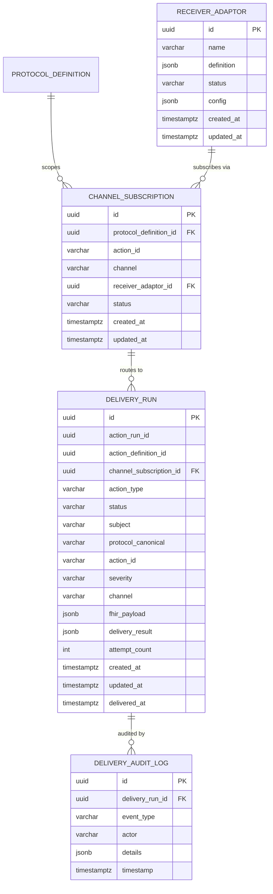

# Data Dictionary

> **CCE Intelligence Service** — Complete database schema reference  
> **Database**: PostgreSQL 16 | **Schema**: `public` | **Migration**: Flyway  
> **Last Updated**: 2026-04-01

---

## Table of Contents

1. [Entity Relationship Diagram](#1-entity-relationship-diagram)
2. [Table Summary](#2-table-summary)
3. [receiver_adaptor](#3-receiver_adaptor) (owned)
4. [channel_subscription](#4-channel_subscription) (owned)
5. [delivery_run](#5-delivery_run) (owned)
6. [delivery_audit_log](#6-delivery_audit_log) (owned)
7. [Compliance Service Tables](#7-compliance-service-tables--not-accessed-at-runtime)
8. [Enumerated Value Reference](#8-enumerated-value-reference)
9. [JSONB Column Schemas](#9-jsonb-column-schemas)
10. [Configuration Properties](#10-configuration-properties)
11. [Metrics](#11-metrics)

---

## 1. Entity Relationship Diagram



> **No read-only tables on the hot path.** The trigger event is self-contained (fat event) — the Intelligence Service does **not** read any Compliance Service tables (`action_run`, `action_definition`, etc.) during trigger processing. The `action_run_id` and `action_definition_id` columns on `delivery_run` are populated from the trigger event for traceability, not as runtime FKs. The `channel_subscription.protocol_definition_id` FK references `protocol_definition` for referential integrity; `protocol_definition` may be joined in low-frequency **admin REST queries** (e.g., to display `protocolCanonical` in channel subscription DTOs) but is never accessed on the trigger processing path.

---

## 2. Table Summary

| # | Table | Owner | Purpose | Row Growth |
|---|-------|-------|---------|-----------|
| 1 | `receiver_adaptor` | Intelligence Service | Registered webhook endpoints for action delivery | Low (handful) |
| 2 | `channel_subscription` | Intelligence Service | Many-to-many routing map: (protocol, action_id, channel) → adaptor | Low–Medium |
| 3 | `delivery_run` | Intelligence Service | Delivery lifecycle per (action_run × adaptor) | High (per action_run × adaptor) |
| 4 | `delivery_audit_log` | Intelligence Service | Audit trail for delivery lifecycle events | High |

> The Intelligence Service owns all 4 tables. It does **not** read any Compliance Service tables at runtime — the trigger event carries all necessary metadata (fat event design).

---

## 3. receiver_adaptor

Stores registered **Receiver Adaptors** — external webhook endpoints that receive intelligence actions. The adaptor's identity, address, and payload capabilities are stored as a **FHIR R4 Endpoint** resource in the `definition` column. Routing is handled by the `channel_subscription` table, not by a column on this entity.

### Columns

| Column | Data Type | Nullable | Default | Description |
|--------|-----------|----------|---------|-------------|
| `id` | `UUID` | **NOT NULL** | `gen_random_uuid()` | Primary key. |
| `name` | `VARCHAR` | **NOT NULL** | — | Human-readable adaptor name. Must match `definition.name`. Denormalized for unique constraint and listing queries. |
| `definition` | `JSONB` | **NOT NULL** | — | FHIR R4 **Endpoint** resource. Contains the adaptor's address, connection type, supported payload types, and status. See [JSONB: definition](#receiver_adaptor--definition). |
| `status` | `VARCHAR` | **NOT NULL** | `'ACTIVE'` | `ACTIVE` or `INACTIVE`. Only active adaptors receive deliveries. |
| `config` | `JSONB` | Yes | — | Additional adaptor configuration (auth headers, retry overrides, custom headers). See [JSONB: config](#receiver_adaptor--config). |
| `created_at` | `TIMESTAMPTZ` | **NOT NULL** | `now()` | Registration timestamp. |
| `updated_at` | `TIMESTAMPTZ` | **NOT NULL** | `now()` | Last update timestamp. |

> **FHIR alignment:** The `definition` column stores a complete FHIR Endpoint resource. The `WebhookDeliveryClient` reads the delivery address from `definition->'address'` and the connection type from `definition->'connectionType'->>'code'` at dispatch time.

### Constraints & Indexes

| Type | Name | Details |
|------|------|---------|
| Primary Key | `receiver_adaptor_pkey` | `id` |
| Unique | `receiver_adaptor_name_key` | `name` — Unique adaptor name. |
| Check | — | `definition->>'resourceType' = 'Endpoint'` |
| Check | — | `definition->>'address' IS NOT NULL` |
| Check | — | `status IN ('ACTIVE', 'INACTIVE')` |

---

## 4. channel_subscription

Maps **(protocol_definition, action_id, channel)** → **receiver_adaptor** for many-to-many routing. Channel names are scoped to a protocol definition — different protocols can reuse the same channel name with different adaptor subscriptions. The optional `action_id` column enables **step-level routing** — different steps within the same protocol can route the same channel to different adaptors.

### Columns

| Column | Data Type | Nullable | Default | Description |
|--------|-----------|----------|---------|-------------|
| `id` | `UUID` | **NOT NULL** | `gen_random_uuid()` | Primary key. |
| `protocol_definition_id` | `UUID` | **NOT NULL** | — | FK → `protocol_definition.id`. Scopes the channel name to this protocol. |
| `action_id` | `VARCHAR` | Yes | `NULL` | PlanDefinition action ID (e.g., `anc-visit-2`, `lab-test-1`). When set, this subscription applies only to triggers for this specific step. When `NULL`, acts as a **wildcard** — applies to any step in the protocol unless a step-specific subscription exists. |
| `channel` | `VARCHAR` | **NOT NULL** | — | Intelligence channel name from PlanDefinition extension or ActionDefinition (e.g., `supervisor`, `patient-reminder`, `lab-coordinator`). |
| `receiver_adaptor_id` | `UUID` | **NOT NULL** | — | FK → `receiver_adaptor.id`. The adaptor subscribed to receive deliveries for this protocol + action_id + channel combination. |
| `status` | `VARCHAR` | **NOT NULL** | `'ACTIVE'` | `ACTIVE` or `INACTIVE`. Only active subscriptions are used for routing. |
| `created_at` | `TIMESTAMPTZ` | **NOT NULL** | `now()` | Subscription creation timestamp. |
| `updated_at` | `TIMESTAMPTZ` | **NOT NULL** | `now()` | Last update timestamp. |

### Constraints & Indexes

| Type | Name | Details |
|------|------|---------|
| Primary Key | `channel_subscription_pkey` | `id` |
| Foreign Key | `channel_subscription_protocol_definition_id_fkey` | `protocol_definition_id` → `protocol_definition(id)` |
| Foreign Key | `channel_subscription_receiver_adaptor_id_fkey` | `receiver_adaptor_id` → `receiver_adaptor(id)` |
| Partial Unique | `channel_subscription_step_key` | `(protocol_definition_id, action_id, channel, receiver_adaptor_id) WHERE action_id IS NOT NULL` — Prevents duplicate step-specific subscriptions. |
| Partial Unique | `channel_subscription_wildcard_key` | `(protocol_definition_id, channel, receiver_adaptor_id) WHERE action_id IS NULL` — Prevents duplicate wildcard subscriptions. |
| Check | — | `status IN ('ACTIVE', 'INACTIVE')` |
| B-tree Index | `idx_channel_subscription_routing` | `(protocol_definition_id, action_id, channel)` — Primary routing lookup. |
| Partial B-tree | `idx_channel_subscription_active` | `status WHERE status = 'ACTIVE'` — Active subscription queries. |
| B-tree Index | `idx_channel_subscription_adaptor` | `receiver_adaptor_id` — Find all subscriptions for an adaptor. |

### Routing Query

Step-specific subscriptions take precedence over wildcard subscriptions. The application layer deduplicates — if a step-specific row exists for an adaptor, the wildcard row for the same adaptor is skipped.

```sql
SELECT cs.id, cs.receiver_adaptor_id, ra.definition->>'address' AS endpoint_url, ra.definition, ra.config, cs.action_id
FROM channel_subscription cs
JOIN receiver_adaptor ra ON ra.id = cs.receiver_adaptor_id
WHERE cs.protocol_definition_id = :protocolDefinitionId
  AND cs.channel = :intelligenceChannel
  AND (cs.action_id = :actionId OR cs.action_id IS NULL)
  AND cs.status = 'ACTIVE'
  AND ra.status = 'ACTIVE'
ORDER BY cs.action_id NULLS LAST
```

### Step-Level Routing Example

| Protocol | action_id | Channel | Receiver Adaptor | Explanation |
|---|---|---|---|---|
| ANC High-Risk v2.1 | `anc-visit-2` | `supervisor` | CHW Team Lead SMS Gateway | Step-specific: ANC visit alerts go to CHW lead |
| ANC High-Risk v2.1 | `lab-test-1` | `supervisor` | Lab Coordinator Dashboard | Step-specific: lab alerts go to lab coordinator |
| ANC High-Risk v2.1 | `NULL` | `supervisor` | CCE Dashboard Adaptor | Wildcard: all other steps' supervisor alerts go to dashboard |
| ANC High-Risk v2.1 | `NULL` | `patient-reminder` | WhatsApp Bot Adaptor | Wildcard: all patient reminders go to WhatsApp |

---

## 5. delivery_run

Tracks the **delivery lifecycle** of an intelligence action to a specific Receiver Adaptor. One row per `(action_run, channel_subscription)` combination. The `(action_run_id, channel_subscription_id)` compound key enforces idempotency — if duplicate trigger events arrive for the same action_run, only the first creates delivery runs. All metadata columns (`action_type`, `severity`, `channel`, `action_id`, etc.) are populated directly from the trigger event — no Compliance table reads required.

### Columns

| Column | Data Type | Nullable | Default | Description |
|--------|-----------|----------|---------|-------------|
| `id` | `UUID` | **NOT NULL** | `gen_random_uuid()` | Primary key. |
| `action_run_id` | `UUID` | **NOT NULL** | — | Compliance Service's `action_run.id`. Idempotency anchor. Stored for traceability, not used as a runtime FK. |
| `action_definition_id` | `UUID` | **NOT NULL** | — | Compliance Service's `action_definition.id`. Stored for traceability, not used as a runtime FK. |
| `channel_subscription_id` | `UUID` | Yes | — | FK → `channel_subscription.id`. Which subscription routed this delivery. `NULL` if no matching subscription found. |
| `action_type` | `VARCHAR` | **NOT NULL** | — | `NOTIFICATION`, `ESCALATION`, or `COORDINATION`. From trigger event `actionType`. Determines FHIR resource type. |
| `status` | `VARCHAR` | **NOT NULL** | — | Delivery status. See [DeliveryRunStatus](#deliveryrunstatus). |
| `subject` | `VARCHAR` | **NOT NULL** | — | Patient UPID. From trigger event `subject`. |
| `protocol_canonical` | `VARCHAR` | **NOT NULL** | — | Protocol `url\|version`. From trigger event `protocolCanonical`. |
| `action_id` | `VARCHAR` | **NOT NULL** | — | PlanDefinition action ID (e.g., `anc-visit-2`). From trigger event `actionId`. |
| `severity` | `VARCHAR` | **NOT NULL** | — | Intelligence severity. From trigger event `severity`. See [IntelligenceSeverity](#intelligenceseverity). |
| `channel` | `VARCHAR` | **NOT NULL** | — | Routing channel name (e.g., `supervisor`). From trigger event `intelligenceChannel`. |
| `fhir_payload` | `JSONB` | **NOT NULL** | — | The FHIR R4 resource (CommunicationRequest or Task) sent to the adaptor. See [JSONB: fhir_payload](#delivery_run--fhir_payload). |
| `delivery_result` | `JSONB` | Yes | — | Delivery response details (HTTP status, error message, attempts). See [JSONB: delivery_result](#delivery_run--delivery_result). |
| `attempt_count` | `INTEGER` | **NOT NULL** | `0` | Number of delivery attempts made. |
| `created_at` | `TIMESTAMPTZ` | **NOT NULL** | `now()` | When the delivery run was created. |
| `updated_at` | `TIMESTAMPTZ` | **NOT NULL** | `now()` | Last status change. |
| `delivered_at` | `TIMESTAMPTZ` | Yes | — | When the action was successfully delivered. `NULL` if not yet delivered. |

### Constraints & Indexes

| Type | Name | Details |
|------|------|---------|
| Primary Key | `delivery_run_pkey` | `id` |
| Foreign Key | `delivery_run_channel_subscription_id_fkey` | `channel_subscription_id` → `channel_subscription(id)` |
| Unique | `delivery_run_action_run_subscription_key` | `(action_run_id, channel_subscription_id)` — Idempotency guard. One delivery per action_run per adaptor. |
| Check | — | `action_type IN ('NOTIFICATION', 'ESCALATION', 'COORDINATION')` |
| Check | — | `status IN ('PENDING', 'EXECUTING', 'DELIVERED', 'FAILED', 'CANCELLED')` |
| Check | — | `severity IN ('LOW', 'MEDIUM', 'HIGH', 'CRITICAL')` |
| B-tree Index | `idx_delivery_run_action_run` | `action_run_id` — Lookup all deliveries for an action_run. |
| B-tree Index | `idx_delivery_run_status` | `status` — Filter by delivery status. |
| B-tree Index | `idx_delivery_run_subject` | `subject` — Patient-centric queries. |
| Partial B-tree | `idx_delivery_run_failed` | `status WHERE status = 'FAILED'` — Quick failed run queries. |

---

## 6. delivery_audit_log

Audit trail for delivery lifecycle events. Written asynchronously (`@Async`) to avoid blocking the main processing pipeline.

### Columns

| Column | Data Type | Nullable | Default | Description |
|--------|-----------|----------|---------|-------------|
| `id` | `UUID` | **NOT NULL** | `gen_random_uuid()` | Primary key. |
| `delivery_run_id` | `UUID` | **NOT NULL** | — | FK → `delivery_run.id`. |
| `event_type` | `VARCHAR` | **NOT NULL** | — | Lifecycle event: `CREATED`, `DISPATCHED`, `DELIVERED`, `FAILED`, `CANCELLED`, `RETRIED`. |
| `actor` | `VARCHAR` | **NOT NULL** | `'system'` | Who/what caused the event (`system` for automated, user ID for manual). |
| `details` | `JSONB` | Yes | — | Event-specific details (HTTP status, error message, adaptor info). |
| `timestamp` | `TIMESTAMPTZ` | **NOT NULL** | `now()` | When the event occurred. |

### Constraints & Indexes

| Type | Name | Details |
|------|------|---------|
| Primary Key | `delivery_audit_log_pkey` | `id` |
| Foreign Key | `delivery_audit_log_delivery_run_id_fkey` | `delivery_run_id` → `delivery_run(id)` |
| B-tree Index | `idx_delivery_audit_log_run` | `delivery_run_id` — All audit entries for a run. |
| B-tree Index | `idx_delivery_audit_log_timestamp` | `timestamp` — Time-range queries. |

---

## 7. Compliance Service Tables — Not Accessed at Runtime

With the **fat event design**, the Intelligence Service does not read any Compliance Service tables during trigger processing. All metadata needed for routing and FHIR payload construction (`actionType`, `severity`, `intelligenceChannel`, `protocolDefinitionId`, `actionDefinitionId`) is carried in the `IntelligenceTriggerEvent` published by the Compliance Service via Kafka.

The `action_run_id` and `action_definition_id` columns on `delivery_run` are stored for **traceability and cross-service correlation** only — they enable diagnostic joins in data warehouses or ad-hoc queries but are not used as runtime foreign keys.

### Previously Accessed Tables (No Longer Read)

| Table | Owner | Previously Used For | Now Provided By |
|-------|-------|--------------------|----|
| `action_run` | Compliance Service | `action_definition_id`, `protocol_instance_id` resolution | Trigger event fields: `actionDefinitionId`, `protocolDefinitionId` |
| `action_definition` | Compliance Service | `action_type`, `severity`, `intelligence_channel` lookup | Trigger event fields: `actionType`, `severity`, `intelligenceChannel` |
| `protocol_instance` | Compliance Service | `protocol_definition_id` for routing | Trigger event field: `protocolDefinitionId` |
| `protocol_definition` | Compliance Service | Routing key for `channel_subscription` | Trigger event field: `protocolDefinitionId` |
| `step_instance` | Compliance Service | Re-evaluation context | Removed — no re-evaluation |

> **Impact:** The Intelligence Service has **zero `@Immutable` JPA entities** and **zero read-only repositories**. The `domain/readonly/` package and corresponding repositories (`ActionDefinitionRepository`, `ActionRunRepository`) are eliminated.


---

## 8. Enumerated Value Reference

### DeliveryRunStatus

| Value | Description |
|-------|-------------|
| `PENDING` | Delivery run created, not yet dispatched |
| `EXECUTING` | Dispatch in progress (webhook call active) |
| `DELIVERED` | Successfully delivered to Receiver Adaptor |
| `FAILED` | Delivery failed after all retry attempts |
| `CANCELLED` | Manually cancelled via API |

### ActionType

Intelligence Service categorization of actions. Carried directly in the trigger event's `actionType` field (resolved by the Compliance Service from `action_definition.action_type`):

| Intelligence Type | FHIR Kind | Description |
|---|---|---|
| `NOTIFICATION` | `CommunicationRequest` | Alert, reminder, or notification |
| `ESCALATION` | `CommunicationRequest` | Elevated alert to supervisor/authority (differentiated by severity) |
| `COORDINATION` | `Task` / `ServiceRequest` | Cross-system task creation or referral |

### ConnectionType (FHIR Endpoint)

The delivery mechanism is now defined by the FHIR Endpoint `connectionType` in `receiver_adaptor.definition`, using the standard FHIR [endpoint-connection-type](http://terminology.hl7.org/CodeSystem/endpoint-connection-type) CodeSystem:

| Code | Display | Description |
|------|---------|-------------|
| `hl7-fhir-rest` | HL7 FHIR REST | RESTful FHIR endpoint (webhook POST) |
| `hl7-fhir-msg` | HL7 FHIR Messaging | FHIR messaging endpoint |
| `secure-email` | Secure Email | Secure email delivery |

### IntelligenceSeverity

| Value | Description | Typical Use |
|-------|-------------|-------------|
| `LOW` | Informational | Reminders |
| `MEDIUM` | Attention needed | First overdue alert |
| `HIGH` | Urgent action required | Escalation after threshold |
| `CRITICAL` | Immediate intervention | Missed critical step |

---

## 9. JSONB Column Schemas

### `receiver_adaptor` → `definition`

A **FHIR R4 Endpoint** resource describing the adaptor's identity, connection type, supported payload types, and address.

```json
{
  "resourceType": "Endpoint",
  "id": "openmrs-prod",
  "status": "active",
  "connectionType": {
    "system": "http://terminology.hl7.org/CodeSystem/endpoint-connection-type",
    "code": "hl7-fhir-rest",
    "display": "HL7 FHIR REST"
  },
  "name": "OpenMRS Production FHIR R4",
  "payloadType": [
    {
      "coding": [
        { "system": "http://hl7.org/fhir/resource-types", "code": "CommunicationRequest" }
      ]
    }
  ],
  "payloadMimeType": ["application/fhir+json"],
  "address": "https://openmrs.example.org/ws/fhir2/R4"
}
```

| Field | FHIR Path | Description |
|-------|-----------|-------------|
| Adaptor ID | `Endpoint.id` | Logical identifier within the Endpoint resource. |
| Status | `Endpoint.status` | FHIR lifecycle status (`active`, `suspended`, `error`, `off`). Application uses the table-level `status` column for routing decisions. |
| Connection type | `Endpoint.connectionType` | Protocol/mechanism (e.g., `hl7-fhir-rest`, `hl7-fhir-msg`, `secure-email`). Replaces the former `delivery_mode` column. |
| Name | `Endpoint.name` | Human-readable name. Must match the table's `name` column. |
| Payload types | `Endpoint.payloadType` | FHIR resource types this endpoint accepts (`CommunicationRequest`, `Task`). |
| MIME types | `Endpoint.payloadMimeType` | Accepted content types (typically `application/fhir+json`). |
| Address | `Endpoint.address` | Webhook URL for action delivery. Must be HTTPS in production. Replaces the former `endpoint_url` column. |

> **Validation:** On `POST /v1/receiver-adaptors`, the service validates that `definition.resourceType == "Endpoint"`, `definition.address` is a valid URL, and `definition.name` matches the top-level `name` field.

### `receiver_adaptor` → `config`

**Credential ownership:** The external Receiver Adaptor operator generates and manages their own auth credentials (API keys, bearer tokens, etc.). A CCE admin registers the adaptor via `POST /v1/receiver-adaptors`, placing the operator-provided credentials into `config`. The `WebhookDeliveryClient` reads `authHeader` + `authValue` at dispatch time and injects them into the outbound HTTP request. The Intelligence Service never *issues* tokens — it only *stores and presents* credentials that the receiving system expects.

> **Security note:** `authValue` contains sensitive credentials and should be encrypted at rest in production (e.g., via PostgreSQL pgcrypto or application-level encryption). Credentials are **never logged** — the `WebhookDeliveryClient` masks them in all log output. `authValue` is **never returned** in REST API responses — DTOs mask it (e.g., `sk-***123`).

> **Webhook signing (HMAC):** When `webhookSecret` is configured, the `WebhookDeliveryClient` computes `HMAC-SHA256(webhookSecret, requestBody)` and sends it as the `X-CCE-Signature-256` header. The receiving system verifies the signature to confirm the request originates from the CCE platform. If `webhookSecret` is `null`, signing is skipped (backward compatible).

> **Separation of concerns:** The FHIR Endpoint in `definition` describes *what* the adaptor is and *where* to deliver. The `config` JSONB stores *how* to authenticate, sign, and operational overrides — concerns that are outside the FHIR Endpoint spec.

```json
{
  "authHeader": "X-API-Key",
  "authValue": "********",
  "webhookSecret": "whsec_abc123...",
  "timeoutMs": 10000,
  "retryOverride": {
    "maxAttempts": 5,
    "intervalMs": 3000
  },
  "customHeaders": {
    "X-Source-System": "cce-intelligence"
  }
}
```

### `delivery_run` → `fhir_payload`

The FHIR R4-compliant resource sent to the Receiver Adaptor. Resource type depends on the trigger event's `actionType`:
- `NOTIFICATION` / `ESCALATION` → `CommunicationRequest`
- `COORDINATION` → `Task`

```json
{
  "resourceType": "CommunicationRequest",
  "identifier": [{
    "system": "http://openphc.org/fhir/delivery-run-id",
    "value": "aaaa-bbbb-cccc-dddd"
  }],
  "status": "active",
  "priority": "urgent",
  "category": [{
    "coding": [{
      "system": "http://openphc.org/fhir/CodeSystem/cce-action-type",
      "code": "ESCALATION",
      "display": "Escalation"
    }]
  }],
  "subject": {
    "identifier": { "system": "http://openphc.org/fhir/patient-upid", "value": "260225-0002-5501" }
  },
  "about": [
    { "reference": "PlanDefinition/anc-high-risk|2.1" },
    { "display": "anc-visit-2" }
  ],
  "payload": [{
    "contentString": "[HIGH] ESCALATION for patient 260225-0002-5501 — step anc-visit-2 overdue (PlanDefinition/anc-high-risk|2.1)"
  }],
  "recipient": [{ "display": "supervisor" }],
  "authoredOn": "2026-04-15T00:00:05Z",
  "extension": [
    { "url": "http://openphc.org/fhir/StructureDefinition/cce-severity", "valueCode": "high" },
    { "url": "http://openphc.org/fhir/StructureDefinition/cce-action-run-id", "valueId": "action-run-uuid" },
    { "url": "http://openphc.org/fhir/StructureDefinition/cce-step-state", "valueCode": "overdue" }
  ]
}
```

### `delivery_run` → `delivery_result`

```json
{
  "httpStatus": 200,
  "responseBody": "{\"status\": \"accepted\"}",
  "deliveredAt": "2026-03-25T00:00:10Z",
  "attempts": [
    { "attempt": 1, "status": 503, "error": "Service Unavailable", "at": "2026-03-25T00:00:06Z" },
    { "attempt": 2, "status": 200, "at": "2026-03-25T00:00:10Z" }
  ]
}
```

### `delivery_audit_log` → `details`

Content varies by event type:

| Event Type | Example |
|---|---|
| `DISPATCHED` | `{"adaptorName": "Kigali South SMS Gateway", "endpointUrl": "https://sms.example.com/webhook"}` |
| `DELIVERED` | `{"httpStatus": 200, "responseBody": "{\"status\": \"accepted\"}"}` |
| `FAILED` | `{"httpStatus": 503, "error": "Service Unavailable", "attemptCount": 3}` |
| `RETRIED` | `{"attempt": 2, "previousStatus": 503, "nextRetryAt": "2026-03-25T00:00:08Z"}` |

---

## 10. Configuration Properties

| Property | Type | Default | Description |
|----------|------|---------|-------------|
| `cce.intelligence.webhook.connect-timeout-ms` | `int` | `10000` | WebClient connection timeout |
| `cce.intelligence.webhook.read-timeout-ms` | `int` | `30000` | WebClient read timeout |
| `cce.intelligence.webhook.retry-attempts` | `int` | `3` | Max delivery retry attempts |
| `cce.intelligence.webhook.retry-interval-ms` | `long` | `2000` | Delay between retries |

---

## 11. Metrics

| Metric Name | Type | Tags | Description |
|-------------|------|------|-------------|
| `cce.intelligence.triggers.received` | Counter | `step_state` | Triggers received from Kafka |
| `cce.intelligence.deliveries.dispatched` | Counter | `action_type`, `severity` | Deliveries dispatched to adaptors |
| `cce.intelligence.deliveries.delivered` | Counter | `action_type` | Successful deliveries |
| `cce.intelligence.deliveries.failed` | Counter | `action_type` | Failed deliveries |
| `cce.intelligence.webhook.duration` | Timer | `adaptor_name` | Webhook response time |
| `cce.intelligence.consumer.errors` | Counter | — | Consumer processing errors |
| `cce.intelligence.subscriptions.active` | Gauge | — | Active channel subscriptions |

---

## 12. Data Retention

`delivery_run` and `delivery_audit_log` are high-growth tables (one row per action_run × adaptor, plus audit entries per lifecycle event). Without a retention strategy, these tables will grow unbounded.

| Strategy | Table | Details |
|---|---|---|
| **Range partitioning** | `delivery_run`, `delivery_audit_log` | Partition by `created_at` / `timestamp` using native PostgreSQL range partitioning or `pg_partman` for automated partition management. Monthly partitions recommended. |
| **Active retention** | Both | Keep the most recent 90 days in active partitions for operational queries. |
| **Archive** | Both | Detach and move partitions older than the retention window to cold storage (S3, Azure Blob). Retain for regulatory compliance period (consult healthcare data retention policy). |
| **Indexes** | Both | Partial indexes on `status` (e.g., `WHERE status = 'FAILED'`) ensure fast queries on active data without scanning archived partitions. |

> **Regulatory note:** Healthcare compliance may require retaining delivery records for extended periods (e.g., 7 years). The archival strategy must balance operational performance with regulatory retention requirements.
