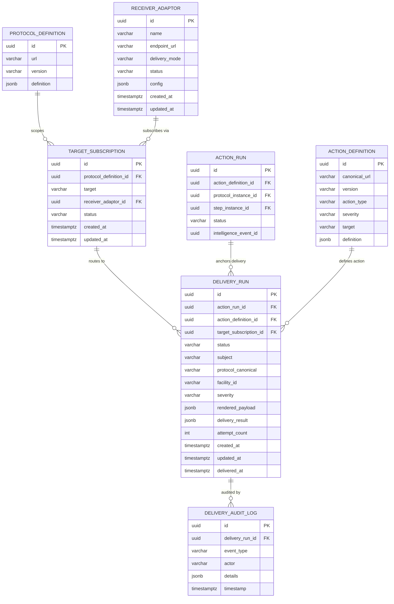

# Data Dictionary

> **CCE Intelligence Service** — Complete database schema reference  
> **Database**: PostgreSQL 16 | **Schema**: `public` | **Migration**: Flyway  
> **Last Updated**: 2026-04-01

---

## Table of Contents

1. [Entity Relationship Diagram](#1-entity-relationship-diagram)
2. [Table Summary](#2-table-summary)
3. [receiver_adaptor](#3-receiver_adaptor) (owned)
4. [target_subscription](#4-target_subscription) (owned)
5. [delivery_run](#5-delivery_run) (owned)
6. [delivery_audit_log](#6-delivery_audit_log) (owned)
7. [Read-Only Tables](#7-read-only-tables-compliance-service)
8. [Enumerated Value Reference](#8-enumerated-value-reference)
9. [JSONB Column Schemas](#9-jsonb-column-schemas)
10. [Configuration Properties](#10-configuration-properties)
11. [Metrics](#11-metrics)

---

## 1. Entity Relationship Diagram



> **Read-only tables** — All 10 Compliance Service tables are accessible as read-only via `@Immutable` JPA entities. The Intelligence Service **never writes** to them. Five tables are actively used by the processing pipeline (`action_run`, `action_definition`, `protocol_definition`, `protocol_instance`, `step_instance`). The remaining five (`deviation`, `action_run_context`, `trigger_index`, `event_log`, `audit_log`) are available for diagnostic queries and traceability but are not required for core trigger processing.

---

## 2. Table Summary

| # | Table | Owner | Purpose | Row Growth |
|---|-------|-------|---------|-----------|
| 1 | `receiver_adaptor` | Intelligence Service | Registered webhook endpoints for action delivery | Low (handful) |
| 2 | `target_subscription` | Intelligence Service | Many-to-many routing map: (protocol, target) → adaptor | Low–Medium |
| 3 | `delivery_run` | Intelligence Service | Delivery lifecycle per (action_run × adaptor) | High (per action_run × adaptor) |
| 4 | `delivery_audit_log` | Intelligence Service | Audit trail for delivery lifecycle events | High |
| 5 | `action_run` | Compliance Service | Trigger lifecycle TRIGGERED → PUBLISHED; FK anchor for delivery_run (read-only) | — |
| 6 | `action_definition` | Compliance Service | FHIR ActivityDefinition resources (read-only) | — |
| 7 | `protocol_definition` | Compliance Service | PlanDefinition with intelligence actions (read-only) | — |
| 8 | `protocol_instance` | Compliance Service | Patient enrollment context (read-only) | — |
| 9 | `step_instance` | Compliance Service | Step runtime state for action evaluation (read-only) | — |
| 10 | `deviation` | Compliance Service | Compliance deviations; available via action_run_context (read-only) | — |
| 11 | `action_run_context` | Compliance Service | Evaluation context snapshot; 1:1 with action_run (read-only) | — |
| 12 | `trigger_index` | Compliance Service | Inverted index for Tier 1 event matching (read-only) | — |
| 13 | `event_log` | Compliance Service | Immutable inbound CloudEvents log (read-only) | — |
| 14 | `audit_log` | Compliance Service | Compliance service audit trail (read-only) | — |

---

## 3. receiver_adaptor

Stores registered **Receiver Adaptors** — external webhook endpoints that receive intelligence actions. Routing is handled by the `target_subscription` table, not by a column on this entity.

### Columns

| Column | Data Type | Nullable | Default | Description |
|--------|-----------|----------|---------|-------------|
| `id` | `UUID` | **NOT NULL** | `gen_random_uuid()` | Primary key. |
| `name` | `VARCHAR` | **NOT NULL** | — | Human-readable name (e.g., "Kigali South SMS Gateway"). |
| `endpoint_url` | `VARCHAR` | **NOT NULL** | — | Webhook URL for action delivery (must be HTTPS in production). |
| `delivery_mode` | `VARCHAR` | **NOT NULL** | `'WEBHOOK'` | Delivery mode. See [DeliveryMode](#deliverymode). |
| `status` | `VARCHAR` | **NOT NULL** | `'ACTIVE'` | `ACTIVE` or `INACTIVE`. Only active adaptors receive deliveries. |
| `config` | `JSONB` | Yes | — | Additional adaptor configuration (auth headers, retry overrides, custom headers). See [JSONB: config](#receiver_adaptor--config). |
| `created_at` | `TIMESTAMPTZ` | **NOT NULL** | `now()` | Registration timestamp. |
| `updated_at` | `TIMESTAMPTZ` | **NOT NULL** | `now()` | Last update timestamp. |

### Constraints & Indexes

| Type | Name | Details |
|------|------|---------|
| Primary Key | `receiver_adaptor_pkey` | `id` |
| Unique | `receiver_adaptor_name_key` | `name` — Unique adaptor name. |
| Check | — | `delivery_mode IN ('WEBHOOK')` |
| Check | — | `status IN ('ACTIVE', 'INACTIVE')` |

---

## 4. target_subscription

Maps **(protocol_definition, target)** → **receiver_adaptor** for many-to-many routing. Target names are scoped to a protocol definition — different protocols can reuse the same target name with different adaptor subscriptions.

### Columns

| Column | Data Type | Nullable | Default | Description |
|--------|-----------|----------|---------|-------------|
| `id` | `UUID` | **NOT NULL** | `gen_random_uuid()` | Primary key. |
| `protocol_definition_id` | `UUID` | **NOT NULL** | — | FK → `protocol_definition.id`. Scopes the target name to this protocol. |
| `target` | `VARCHAR` | **NOT NULL** | — | Intelligence target name from PlanDefinition extension or ActionDefinition (e.g., `supervisor`, `patient-reminder`, `lab-coordinator`). |
| `receiver_adaptor_id` | `UUID` | **NOT NULL** | — | FK → `receiver_adaptor.id`. The adaptor subscribed to receive deliveries for this protocol + target combination. |
| `status` | `VARCHAR` | **NOT NULL** | `'ACTIVE'` | `ACTIVE` or `INACTIVE`. Only active subscriptions are used for routing. |
| `created_at` | `TIMESTAMPTZ` | **NOT NULL** | `now()` | Subscription creation timestamp. |
| `updated_at` | `TIMESTAMPTZ` | **NOT NULL** | `now()` | Last update timestamp. |

### Constraints & Indexes

| Type | Name | Details |
|------|------|---------|
| Primary Key | `target_subscription_pkey` | `id` |
| Foreign Key | `target_subscription_protocol_definition_id_fkey` | `protocol_definition_id` → `protocol_definition(id)` |
| Foreign Key | `target_subscription_receiver_adaptor_id_fkey` | `receiver_adaptor_id` → `receiver_adaptor(id)` |
| Unique | `target_subscription_protocol_target_adaptor_key` | `(protocol_definition_id, target, receiver_adaptor_id)` — Prevents duplicate subscriptions. |
| Check | — | `status IN ('ACTIVE', 'INACTIVE')` |
| B-tree Index | `idx_target_subscription_protocol_target` | `(protocol_definition_id, target)` — Primary routing lookup. |
| Partial B-tree | `idx_target_subscription_active` | `status WHERE status = 'ACTIVE'` — Active subscription queries. |
| B-tree Index | `idx_target_subscription_adaptor` | `receiver_adaptor_id` — Find all subscriptions for an adaptor. |

### Routing Query

```sql
SELECT ts.id, ts.receiver_adaptor_id, ra.endpoint_url, ra.config
FROM target_subscription ts
JOIN receiver_adaptor ra ON ra.id = ts.receiver_adaptor_id
WHERE ts.protocol_definition_id = :protocolDefinitionId
  AND ts.target = :target
  AND ts.status = 'ACTIVE'
  AND ra.status = 'ACTIVE'
```

---

## 5. delivery_run

Tracks the **delivery lifecycle** of an intelligence action to a specific Receiver Adaptor. One row per `(action_run, target_subscription)` combination. The `(action_run_id, target_subscription_id)` compound key enforces idempotency — if duplicate trigger events arrive for the same action_run, only the first creates delivery runs. The `action_run_id` FK anchors each delivery to the Compliance Service's `action_run` record, which is created for **both** deviation-based (overdue, missed) and match-based (step.completed.late) triggers.

### Columns

| Column | Data Type | Nullable | Default | Description |
|--------|-----------|----------|---------|-------------|
| `id` | `UUID` | **NOT NULL** | `gen_random_uuid()` | Primary key. |
| `action_run_id` | `UUID` | **NOT NULL** | — | FK → `action_run.id` (Compliance-owned, read-only). The action_run that triggered this delivery. |
| `action_definition_id` | `UUID` | **NOT NULL** | — | FK → `action_definition.id` (Compliance-owned, read-only). The FHIR ActivityDefinition that was resolved. |
| `target_subscription_id` | `UUID` | Yes | — | FK → `target_subscription.id`. Which subscription routed this delivery. `NULL` if no matching subscription found. |
| `status` | `VARCHAR` | **NOT NULL** | — | Delivery status. See [DeliveryRunStatus](#deliveryrunstatus). |
| `subject` | `VARCHAR` | **NOT NULL** | — | Patient UPID. |
| `protocol_canonical` | `VARCHAR` | **NOT NULL** | — | Protocol `url\|version`. |
| `facility_id` | `VARCHAR` | Yes | — | FOSA facility code, extracted from `subject` UPID (positions 7-10: `260225-XXXX-5501`). |
| `severity` | `VARCHAR` | **NOT NULL** | — | Intelligence severity. See [IntelligenceSeverity](#intelligenceseverity). |
| `rendered_payload` | `JSONB` | **NOT NULL** | — | The fully rendered action payload sent to the adaptor. |
| `delivery_result` | `JSONB` | Yes | — | Delivery response details (HTTP status, error message, attempts). See [JSONB: delivery_result](#delivery_run--delivery_result). |
| `attempt_count` | `INTEGER` | **NOT NULL** | `0` | Number of delivery attempts made. |
| `created_at` | `TIMESTAMPTZ` | **NOT NULL** | `now()` | When the delivery run was created. |
| `updated_at` | `TIMESTAMPTZ` | **NOT NULL** | `now()` | Last status change. |
| `delivered_at` | `TIMESTAMPTZ` | Yes | — | When the action was successfully delivered. `NULL` if not yet delivered. |

### Constraints & Indexes

| Type | Name | Details |
|------|------|---------|
| Primary Key | `delivery_run_pkey` | `id` |
| Foreign Key | `delivery_run_action_run_id_fkey` | `action_run_id` → `action_run(id)` |
| Foreign Key | `delivery_run_action_definition_id_fkey` | `action_definition_id` → `action_definition(id)` |
| Foreign Key | `delivery_run_target_subscription_id_fkey` | `target_subscription_id` → `target_subscription(id)` |
| Unique | `delivery_run_action_run_subscription_key` | `(action_run_id, target_subscription_id)` — Idempotency guard. One delivery per action_run per adaptor. |
| Check | — | `status IN ('PENDING', 'EXECUTING', 'DELIVERED', 'FAILED', 'CANCELLED')` |
| Check | — | `severity IN ('LOW', 'MEDIUM', 'HIGH', 'CRITICAL')` |
| B-tree Index | `idx_delivery_run_action_run` | `action_run_id` — Lookup all deliveries for an action_run. |
| B-tree Index | `idx_delivery_run_status` | `status` — Filter by delivery status. |
| B-tree Index | `idx_delivery_run_subject` | `subject` — Patient-centric queries. |
| Partial B-tree | `idx_delivery_run_failed` | `status WHERE status = 'FAILED'` — Quick failed run queries. |

---

## 6. delivery_audit_log

Audit trail for delivery lifecycle events. Written asynchronously (`@Async`) to avoid blocking the main processing pipeline.

### Columns

| Column | Data Type | Nullable | Default | Description |
|--------|-----------|----------|---------|-------------|
| `id` | `UUID` | **NOT NULL** | `gen_random_uuid()` | Primary key. |
| `delivery_run_id` | `UUID` | **NOT NULL** | — | FK → `delivery_run.id`. |
| `event_type` | `VARCHAR` | **NOT NULL** | — | Lifecycle event: `CREATED`, `DISPATCHED`, `DELIVERED`, `FAILED`, `CANCELLED`, `RETRIED`. |
| `actor` | `VARCHAR` | **NOT NULL** | `'system'` | Who/what caused the event (`system` for automated, user ID for manual). |
| `details` | `JSONB` | Yes | — | Event-specific details (HTTP status, error message, adaptor info). |
| `timestamp` | `TIMESTAMPTZ` | **NOT NULL** | `now()` | When the event occurred. |

### Constraints & Indexes

| Type | Name | Details |
|------|------|---------|
| Primary Key | `delivery_audit_log_pkey` | `id` |
| Foreign Key | `delivery_audit_log_delivery_run_id_fkey` | `delivery_run_id` → `delivery_run(id)` |
| B-tree Index | `idx_delivery_audit_log_run` | `delivery_run_id` — All audit entries for a run. |
| B-tree Index | `idx_delivery_audit_log_timestamp` | `timestamp` — Time-range queries. |

---

## 7. Read-Only Tables (Compliance Service)

The Intelligence Service has read access to **all 10 Compliance Service tables** but **never writes** to them. Entities use `@Immutable`. Five tables are actively used by the core processing pipeline; the remaining five are available for diagnostic queries, traceability, and future use.

### Actively Used Tables

### 7.1 `action_definition`

The Compliance Service's FHIR ActivityDefinition catalog. The Intelligence Service reads this to resolve `definitionCanonical` → action type, severity, target, and message template (embedded in the `definition` JSONB).

| Column | Type | Used By Intelligence | Purpose |
|--------|------|---------------------|---------|
| `id` | `UUID` | Yes | PK — FK from `delivery_run.action_definition_id` |
| `canonical_url` | `VARCHAR` | Yes | Resolve `definitionCanonical` → ActionDefinition |
| `version` | `VARCHAR` | Yes | Version matching for canonical lookup |
| `name` | `VARCHAR` | No | — |
| `title` | `VARCHAR` | No | — |
| `status` | `VARCHAR` | Yes | Only resolve `ACTIVE` definitions |
| `action_type` | `VARCHAR` | Yes | `CommunicationRequest`, `Task`, `ServiceRequest` — maps to delivery behavior |
| `severity` | `VARCHAR` | Yes | Default severity if not overridden by PlanDefinition extension |
| `target` | `VARCHAR` | Yes | Default target for routing lookup in `target_subscription` |
| `definition` | `JSONB` | **Yes** | Extract message template from FHIR extension `cce-message-template` |
| `created_at` | `TIMESTAMPTZ` | No | — |
| `updated_at` | `TIMESTAMPTZ` | No | — |

### 7.2 `protocol_definition`

| Column | Type | Used By Intelligence | Purpose |
|--------|------|---------------------|---------|
| `id` | `UUID` | Yes | PK — used for `target_subscription` routing lookup |
| `url` | `VARCHAR` | Yes | Protocol canonical URL |
| `version` | `VARCHAR` | Yes | Protocol version |
| `status` | `VARCHAR` | Yes | Filter active protocols |
| `definition` | `JSONB` | **Yes** | Extract intelligence actions (nested sub-actions with conditions + definitionCanonical) |
| `loaded_at` | `TIMESTAMPTZ` | No | — |

### 7.3 `protocol_instance`

| Column | Type | Used By Intelligence | Purpose |
|--------|------|---------------------|---------|
| `id` | `UUID` | Yes | PK |
| `patient_id` | `VARCHAR` | Yes | Patient UPID for template rendering |
| `protocol_canonical` | `VARCHAR` | Yes | Protocol ref for context |
| `protocol_definition_id` | `UUID` | Yes | FK — used to resolve protocol_definition for routing |
| `enrolled_at` | `TIMESTAMPTZ` | Yes | Available for template variables |
| `status` | `VARCHAR` | Yes | Only process for `ACTIVE` instances |
| `created_at` | `TIMESTAMPTZ` | No | — |
| `updated_at` | `TIMESTAMPTZ` | No | — |

### 7.4 `step_instance`

| Column | Type | Used By Intelligence | Purpose |
|--------|------|---------------------|---------|
| `id` | `UUID` | Yes | PK |
| `protocol_instance_id` | `UUID` | Yes | FK to protocol |
| `action_id` | `VARCHAR` | Yes | Match to PlanDefinition action for nested rules |
| `repeat_index` | `INTEGER` | Yes | ActionEvaluationContext variable |
| `state` | `VARCHAR` | Yes | Step state for ActionEvaluationContext (`stepState`) |
| `due_date` | `TIMESTAMPTZ` | Yes | Compute `daysOverdue` |
| `overdue_date` | `TIMESTAMPTZ` | Yes | Overdue threshold |
| `missed_date` | `TIMESTAMPTZ` | Yes | Compute `daysPastMissedDate` |
| `completed_at` | `TIMESTAMPTZ` | Yes | ActionEvaluationContext variable |
| `completion_status` | `VARCHAR` | Yes | ActionEvaluationContext — `ON_TIME`, `EARLY`, `LATE` |
| `required_behavior` | `VARCHAR` | Yes | ActionEvaluationContext variable (`must`, `could`, `must-unless-documented`) |

### 7.5 `action_run` (Compliance-owned)

Tracks the **trigger lifecycle** (TRIGGERED → PUBLISHED) on the Compliance Service side. The Intelligence Service reads `action_run` to resolve the originating `action_definition_id` and anchors `delivery_run` records via `delivery_run.action_run_id` FK. Created by Compliance for **both** deviation-based (overdue, missed) and match-based (step.completed.late) triggers.

| Column | Type | Used By Intelligence | Purpose |
|--------|------|---------------------|---------|
| `id` | `UUID` | **Yes** | PK — FK from `delivery_run.action_run_id` |
| `action_definition_id` | `UUID` | **Yes** | Resolves the ActionDefinition for template rendering and routing |
| `protocol_instance_id` | `UUID` | **Yes** | FK to protocol — used for `target_subscription` routing lookup via `protocol_definition_id` |
| `step_instance_id` | `UUID` | **Yes** | FK to step — available for template context |
| `status` | `VARCHAR` | **Yes** | TRIGGERED/PUBLISHED/FAILED/CANCELLED — filter for processable runs |
| `intelligence_event_id` | `UUID` | **Yes** | Correlates with the `IntelligenceTriggerEvent.id` from Kafka |
| `output_metadata` | `JSONB` | No | — |

### Available Tables (Diagnostic & Traceability)

These tables are accessible as read-only but are not required for the core trigger processing pipeline. They support diagnostic queries, traceability, and analytics.

### 7.6 `deviation`

Compliance deviations (overdue and missed steps). Available for traceability via `action_run_context.deviation_id`.

| Column | Type | Used By Intelligence | Purpose |
|--------|------|---------------------|--------|
| `id` | `UUID` | Available | PK |
| `step_instance_id` | `UUID` | Available | FK to step |
| `deviation_type` | `VARCHAR` | Available | `overdue` or `missed` |
| `detected_at` | `TIMESTAMPTZ` | Available | When deviation was detected |
| `intelligence_event_id` | `UUID` | Available | Correlates with trigger event ID |

### 7.7 `action_run_context`

Evaluation context for why an action fired. 1:1 relationship with `action_run`. Contains the full JSONLogic evaluation context as a JSONB snapshot.

| Column | Type | Used By Intelligence | Purpose |
|--------|------|---------------------|--------|
| `id` | `UUID` | Available | PK |
| `action_run_id` | `UUID` | Available | FK to `action_run` (1:1) |
| `deviation_id` | `UUID` | Available | FK to `deviation` (null for late-completion triggers) |
| `trigger_reason` | `VARCHAR` | Available | Why the action fired |
| `step_action_id` | `VARCHAR` | Available | PlanDefinition action ID |
| `evaluation_context` | `JSONB` | Available | Full JSONLogic evaluation context snapshot (stepState, deviationType, daysOverdue, etc.) |

> **Note:** `action_run_context.evaluation_context` contains a point-in-time JSONB snapshot of all runtime variables at trigger time. The Intelligence Service computes current values from `step_instance` for re-evaluation, but this snapshot is useful for audit/diagnostic purposes.

### 7.8 `trigger_index`

Inverted index for fast Tier 1 structural event matching. Rebuilt when protocols are loaded or retired.

| Column | Type | Used By Intelligence | Purpose |
|--------|------|---------------------|--------|
| `id` | `UUID` | No | PK |
| `protocol_definition_id` | `UUID` | No | FK to protocol |
| `action_id` | `VARCHAR` | No | PlanDefinition action ID |
| `resource_type` | `VARCHAR` | No | FHIR resource type trigger |
| `code_filter` | `JSONB` | No | DataRequirement code filters |

### 7.9 `event_log`

Immutable log of all inbound CloudEvents processed by the Collector Service. Monthly-partitioned.

| Column | Type | Used By Intelligence | Purpose |
|--------|------|---------------------|--------|
| `id` | `UUID` | No | PK |
| `cloudevents_id` | `VARCHAR` | No | CloudEvent ID |
| `source` | `VARCHAR` | No | Event source |
| `type` | `VARCHAR` | No | Event type |
| `subject` | `VARCHAR` | No | Patient UPID |
| `time` | `TIMESTAMPTZ` | No | Event timestamp |
| `data` | `JSONB` | No | Event payload |
| `processing_status` | `VARCHAR` | No | Processing outcome |

### 7.10 `audit_log`

Compliance Service audit trail for significant operations.

| Column | Type | Used By Intelligence | Purpose |
|--------|------|---------------------|--------|
| `id` | `UUID` | No | PK |
| `entity_type` | `VARCHAR` | No | Audited entity type |
| `entity_id` | `UUID` | No | Audited entity ID |
| `action` | `VARCHAR` | No | Audit action |
| `actor` | `VARCHAR` | No | Who performed the action |
| `details` | `JSONB` | No | Action details |
| `timestamp` | `TIMESTAMPTZ` | No | When the action occurred |

> **Access note:** Tables 7.6–7.10 are available for ad-hoc diagnostic queries and can be surfaced through future API endpoints. They are not mapped to `@Immutable` entities unless a concrete use case arises during implementation.

---

## 8. Enumerated Value Reference

### DeliveryRunStatus

| Value | Description |
|-------|-------------|
| `PENDING` | Delivery run created, not yet dispatched |
| `EXECUTING` | Dispatch in progress (webhook call active) |
| `DELIVERED` | Successfully delivered to Receiver Adaptor |
| `FAILED` | Delivery failed after all retry attempts |
| `CANCELLED` | Manually cancelled via API |

### ActionType

Intelligence Service categorization of actions. Derived from the Compliance Service's `action_definition.action_type` (FHIR `ActivityDefinition.kind`):

| Intelligence Type | FHIR Kind | Description |
|---|---|---|
| `NOTIFICATION` | `CommunicationRequest` | Alert, reminder, or notification |
| `ESCALATION` | `CommunicationRequest` | Elevated alert to supervisor/authority (differentiated by severity) |
| `COORDINATION` | `Task` / `ServiceRequest` | Cross-system task creation or referral |

### DeliveryMode

| Value | Description | Status |
|-------|-------------|--------|
| `WEBHOOK` | HTTP POST to adaptor endpoint | 1.0.0 |
| `TOPIC_SUBSCRIPTION` | Adaptor pulls from a Kafka topic | Future |

### IntelligenceSeverity

| Value | Description | Typical Use |
|-------|-------------|-------------|
| `LOW` | Informational | Reminders |
| `MEDIUM` | Attention needed | First overdue alert |
| `HIGH` | Urgent action required | Escalation after threshold |
| `CRITICAL` | Immediate intervention | Missed critical step |

---

## 9. JSONB Column Schemas

### `receiver_adaptor` → `config`

```json
{
  "authHeader": "X-API-Key",
  "authValue": "********",
  "timeoutMs": 10000,
  "retryOverride": {
    "maxAttempts": 5,
    "intervalMs": 3000
  },
  "customHeaders": {
    "X-Facility-Code": "FOSA-KGL-001"
  }
}
```

### `delivery_run` → `rendered_payload`

The fully rendered action payload sent to the Receiver Adaptor:

```json
{
  "type": "NOTIFICATION",
  "severity": "HIGH",
  "subject": "260225-0002-5501",
  "protocolCanonical": "http://openphc.org/fhir/PlanDefinition/anc-high-risk|2.1",
  "actionId": "anc-visit-2",
  "facilityId": "0002",
  "message": "Patient 260225-0002-5501 step anc-visit-2 is 5 days overdue at facility 0002",
  "metadata": {
    "deviationType": "overdue",
    "daysOverdue": 5,
    "dueDate": "2026-03-20T00:00:00Z",
    "overdueDate": "2026-03-25T00:00:00Z"
  }
}
```

### `delivery_run` → `delivery_result`

```json
{
  "httpStatus": 200,
  "responseBody": "{\"status\": \"accepted\"}",
  "deliveredAt": "2026-03-25T00:00:10Z",
  "attempts": [
    { "attempt": 1, "status": 503, "error": "Service Unavailable", "at": "2026-03-25T00:00:06Z" },
    { "attempt": 2, "status": 200, "at": "2026-03-25T00:00:10Z" }
  ]
}
```

### `delivery_audit_log` → `details`

Content varies by event type:

| Event Type | Example |
|---|---|
| `DISPATCHED` | `{"adaptorName": "Kigali South SMS Gateway", "endpointUrl": "https://sms.example.com/webhook"}` |
| `DELIVERED` | `{"httpStatus": 200, "responseBody": "{\"status\": \"accepted\"}"}` |
| `FAILED` | `{"httpStatus": 503, "error": "Service Unavailable", "attemptCount": 3}` |
| `RETRIED` | `{"attempt": 2, "previousStatus": 503, "nextRetryAt": "2026-03-25T00:00:08Z"}` |

---

## 10. Configuration Properties

| Property | Type | Default | Description |
|----------|------|---------|-------------|
| `cce.intelligence.webhook.connect-timeout-ms` | `int` | `10000` | WebClient connection timeout |
| `cce.intelligence.webhook.read-timeout-ms` | `int` | `30000` | WebClient read timeout |
| `cce.intelligence.webhook.retry-attempts` | `int` | `3` | Max delivery retry attempts |
| `cce.intelligence.webhook.retry-interval-ms` | `long` | `2000` | Delay between retries |

---

## 11. Metrics

| Metric Name | Type | Tags | Description |
|-------------|------|------|-------------|
| `cce.intelligence.triggers.received` | Counter | `deviation_type` | Triggers received from Kafka |
| `cce.intelligence.actions.evaluated` | Counter | `result` | Rules evaluated (matched/skipped/error) |
| `cce.intelligence.deliveries.dispatched` | Counter | `action_type`, `severity` | Deliveries dispatched to adaptors |
| `cce.intelligence.deliveries.delivered` | Counter | `action_type` | Successful deliveries |
| `cce.intelligence.deliveries.failed` | Counter | `action_type` | Failed deliveries |
| `cce.intelligence.webhook.duration` | Timer | `adaptor_name` | Webhook response time |
| `cce.intelligence.consumer.errors` | Counter | — | Consumer processing errors |
| `cce.intelligence.subscriptions.active` | Gauge | — | Active target subscriptions |
