# Flow Diagrams

> **CCE Intelligence Service** — Visual representation of core processing flows  
> All diagrams use [Mermaid](https://mermaid.js.org/) syntax.

---

## Table of Contents

1. [End-to-End Intelligence Pipeline](#1-end-to-end-intelligence-pipeline)
2. [Trigger Processing Sequence](#2-trigger-processing-sequence)
3. [Intelligence Action Evaluation](#3-intelligence-action-evaluation)
4. [Target Subscription Routing](#4-target-subscription-routing)
5. [Action Dispatch & Webhook Delivery](#5-action-dispatch--webhook-delivery)
6. [Delivery Run Lifecycle](#6-delivery-run-lifecycle)
7. [Retry & Error Handling](#7-retry--error-handling)
8. [REST API Flows](#8-rest-api-flows)

---

## 1. End-to-End Intelligence Pipeline

High-level data flow from Compliance Service trigger through to Receiver Adaptor delivery.

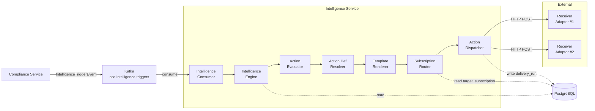

---

## 2. Trigger Processing Sequence

Detailed sequence diagram showing the interaction between components when processing an intelligence trigger with fan-out delivery.

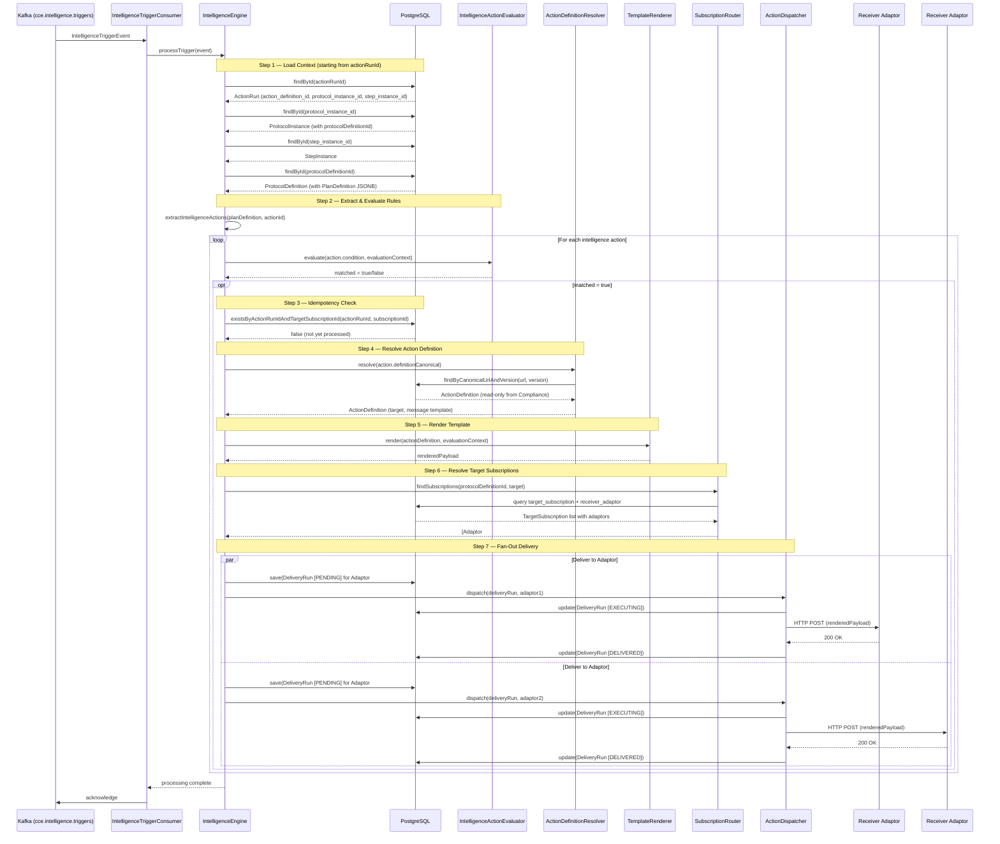

---

## 3. Intelligence Action Evaluation

How intelligence actions are extracted from PlanDefinition and evaluated using JSONLogic.

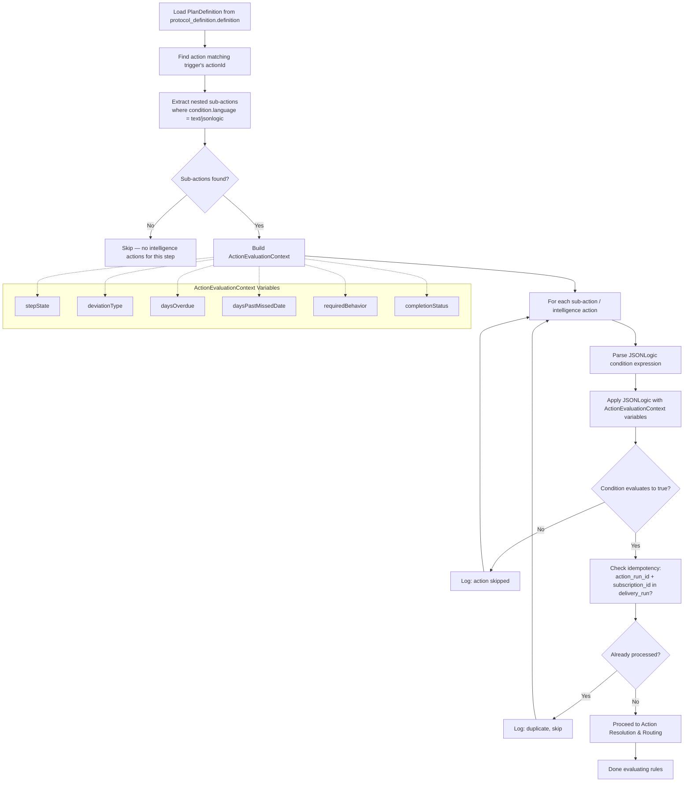

### ActionEvaluationContext Variable Computation

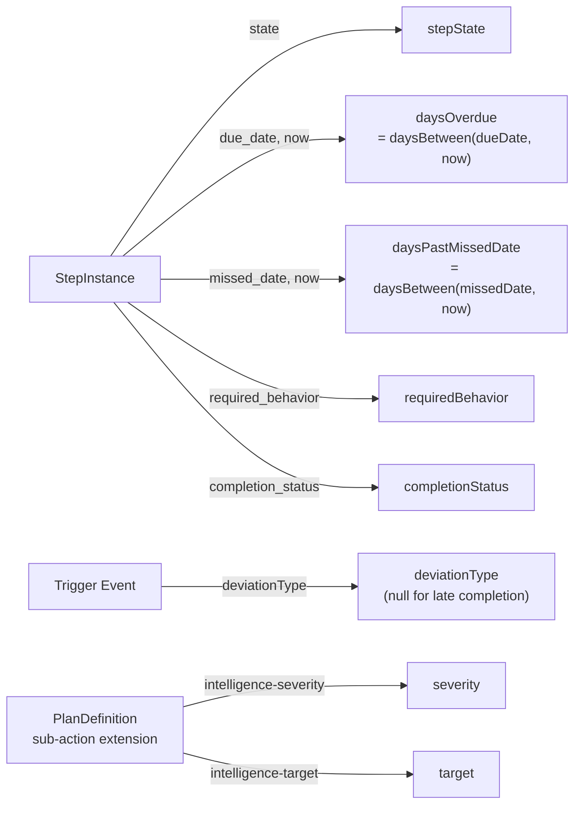

---

## 4. Target Subscription Routing

How the Intelligence Service resolves which Receiver Adaptors should receive a delivery for a given protocol + target combination.

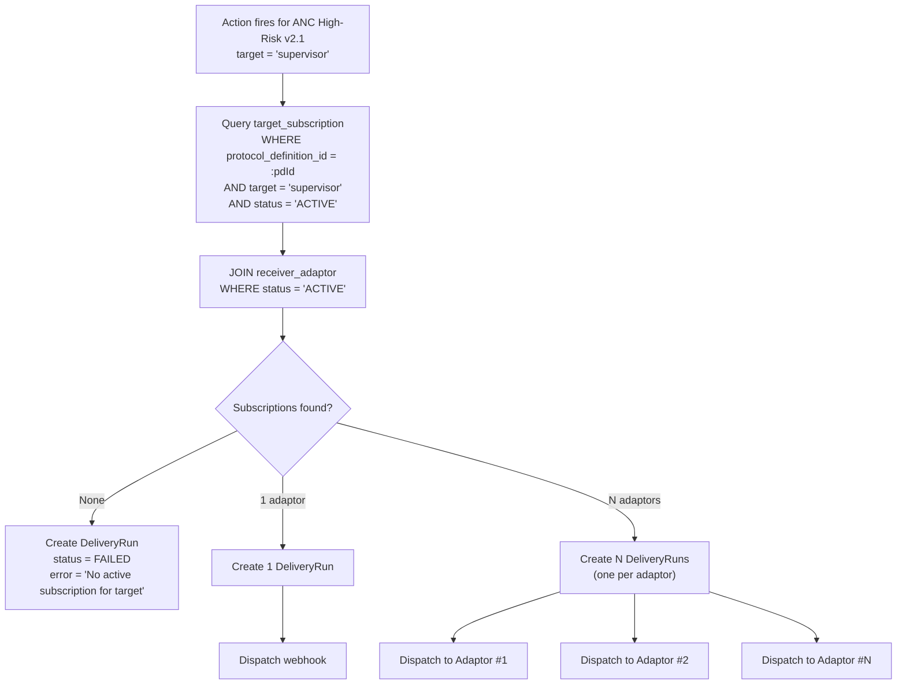

### Cross-Protocol Routing Example

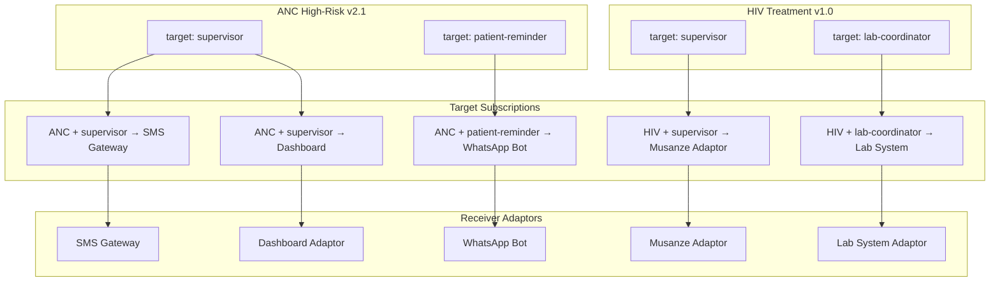

---

## 5. Action Dispatch & Webhook Delivery

How the Intelligence Service delivers an action to each subscribed Receiver Adaptor via webhook.

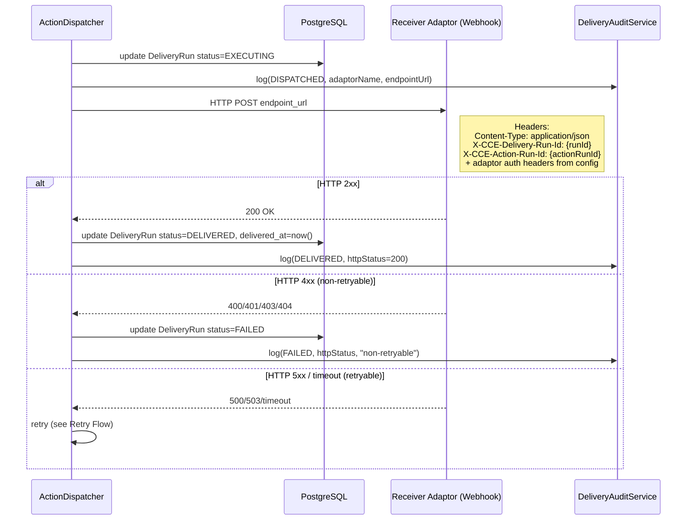

### Webhook Payload

```mermaid
flowchart LR
    AD[ActionDefinition<br/>.definition JSONB<br/>(FHIR extension)] --> TR[TemplateRenderer]
    RC[ActionEvaluationContext<br/>variables] --> TR
    TE[TriggerEvent<br/>fields] --> TR
    TR --> P[Rendered Payload JSON]
    P --> H[HTTP POST Body]

    subgraph "HTTP POST to Receiver Adaptor"
        H
        Headers["Headers:<br/>Content-Type: application/json<br/>X-CCE-Delivery-Run-Id<br/>X-CCE-Trigger-Event-Id<br/>+ adaptor.config auth"]
    end
```

---

## 6. Delivery Run Lifecycle

State machine for `delivery_run.status` — all valid transitions.

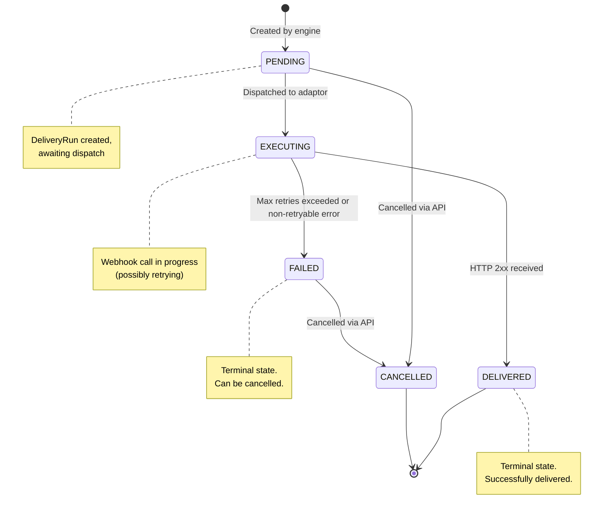

---

## 7. Retry & Error Handling

### 7.1 Webhook Delivery Retry

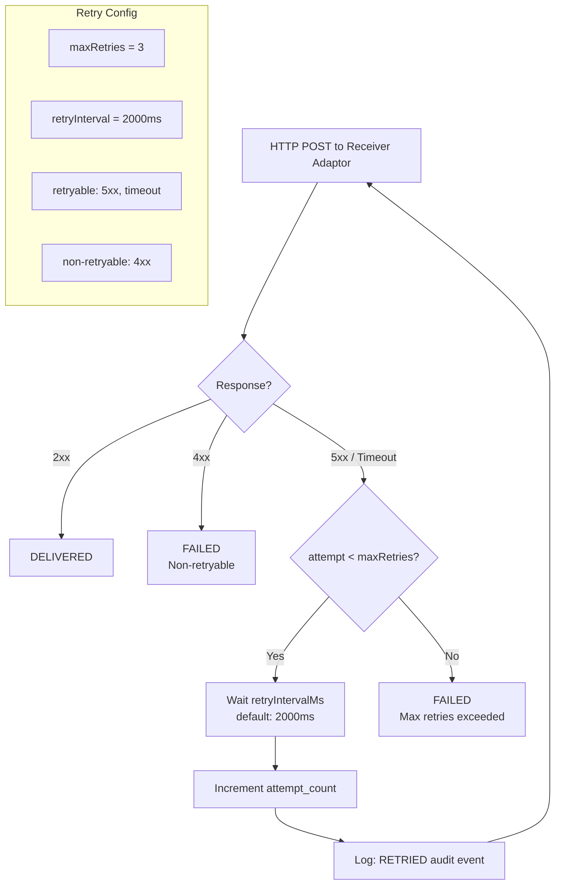

### 7.2 Kafka Consumer Error Handling

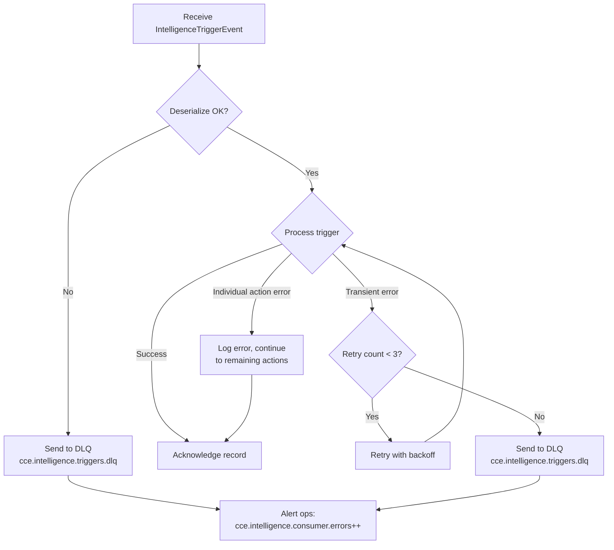

---

## 8. REST API Flows

### 8.1 Create Target Subscription

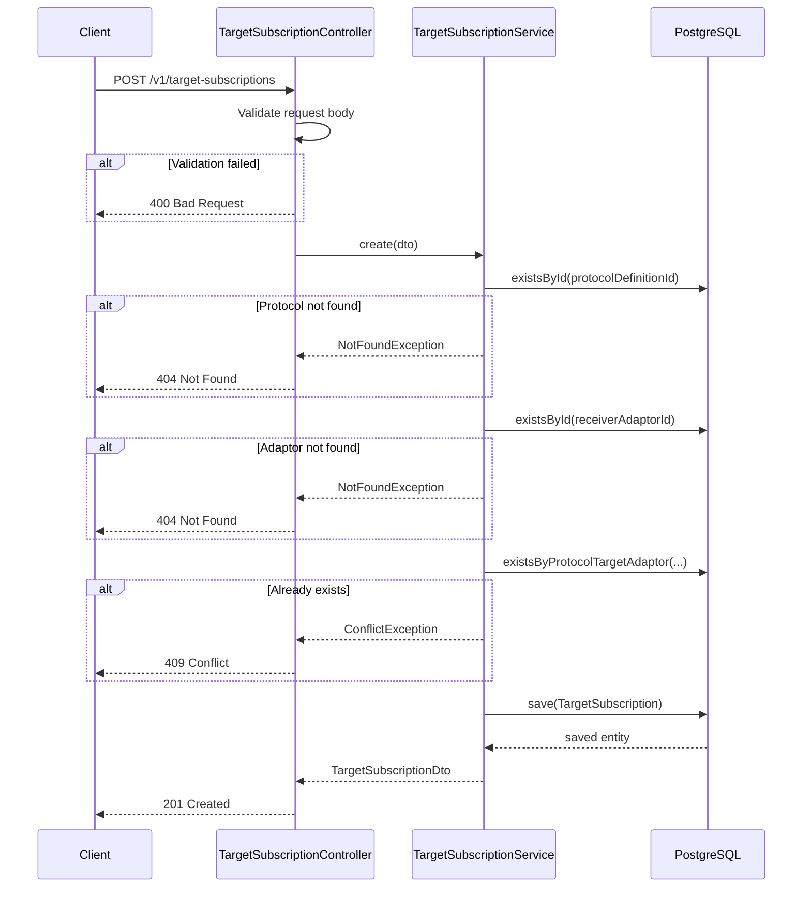

### 8.2 Cancel Delivery Run

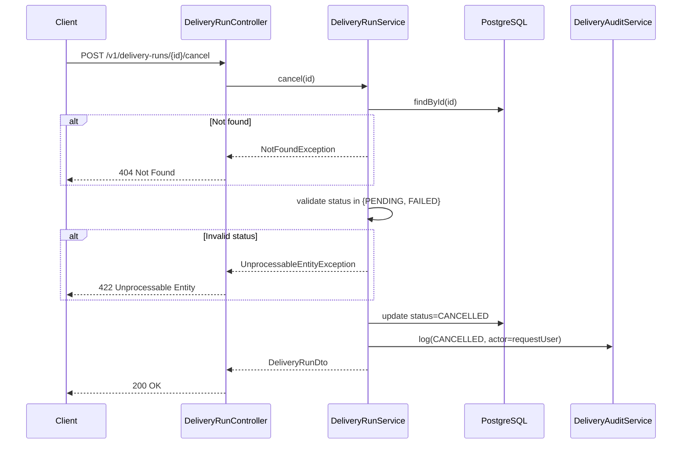

### 8.3 Delete Receiver Adaptor

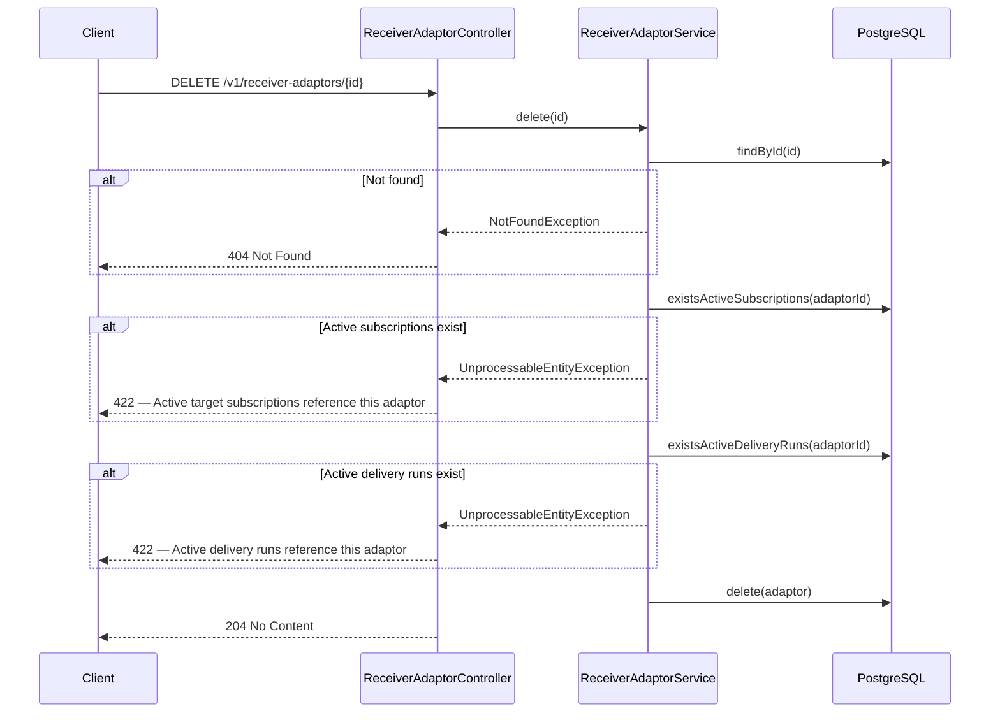
