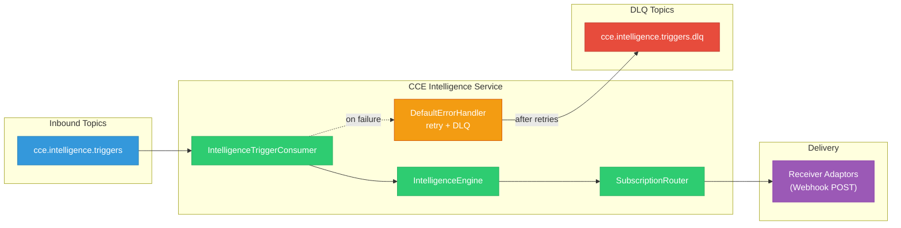
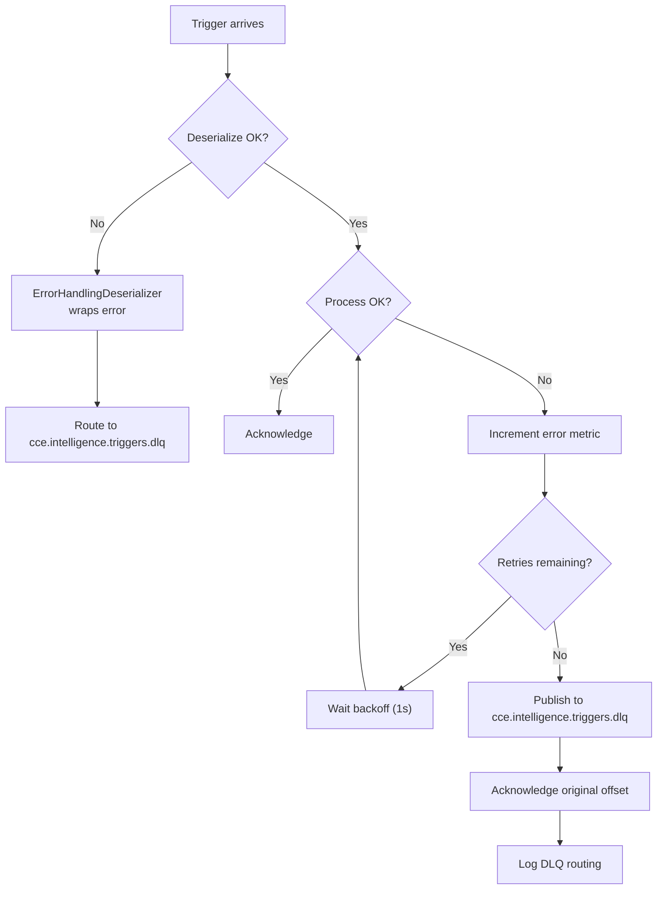

# Kafka & Event Architecture

## 1. Overview

The CCE Intelligence Service **consumes** intelligence triggers from the Compliance Service via Kafka. It does not produce to any Kafka topic — action delivery is via webhook HTTP POST to Receiver Adaptors.



---

## 2. Topic Reference

| Topic | Direction | Partitions | Consumer Group | Description |
|---|---|---|---|---|
| `cce.intelligence.triggers` | Inbound | 25 | `cce-intelligence-service` | Intelligence triggers from Compliance Service (deviation + completion events) |
| `cce.intelligence.triggers.dlq` | DLQ | 25 | — | Dead letter queue for failed trigger processing |

The `cce.intelligence.triggers` topic is declared as a `NewTopic` bean by the **Compliance Service**'s `KafkaConfig`. The Intelligence Service declares only the DLQ topic.

---

## 3. Consumer Configuration

### 3.1 Common Settings

```yaml
spring.kafka:
  bootstrap-servers: ${KAFKA_BOOTSTRAP_SERVERS:localhost:9092}
  consumer:
    group-id: cce-intelligence-service
    auto-offset-reset: earliest
    enable-auto-commit: false
    properties:
      isolation.level: read_committed
      max.poll.records: 100
      max.poll.interval.ms: 300000
  listener:
    ack-mode: record
    concurrency: 3
```

| Setting | Value | Rationale |
|---|---|---|
| `auto-offset-reset` | `earliest` | Process all triggers from beginning on first join |
| `enable-auto-commit` | `false` | Framework-managed offset commits |
| `isolation.level` | `read_committed` | Only consume committed messages |
| `max.poll.records` | `100` | Batch size per poll |
| `ack-mode` | `RECORD` | Offset committed per record after successful processing |
| `concurrency` | `3` | 3 concurrent listener threads per instance |

### 3.2 Deserialization

```java
// Consumer factory uses ErrorHandlingDeserializer wrapping JsonDeserializer
ConsumerFactory<String, IntelligenceTriggerEvent>
  Key:   StringDeserializer
  Value: ErrorHandlingDeserializer → JsonDeserializer<IntelligenceTriggerEvent>

// Trusted packages
spring.json.trusted.packages: "org.openphc.cce.intelligence.*"
```

### 3.3 Retry & Dead Letter Queue

```yaml
cce.kafka:
  retry:
    max-attempts: 3
    backoff-interval-ms: 1000
```

Spring Kafka's `DefaultErrorHandler` is configured with `FixedBackOff` and `DeadLetterPublishingRecoverer`:

1. **Retry** — up to `max-attempts` with `backoff-interval-ms` between attempts
2. **DLQ** — after exhausting retries, publish to `cce.intelligence.triggers.dlq`
3. **Acknowledge** — original offset committed to move past the failed record

### 3.4 DLQ Topic Provisioning

```yaml
cce.kafka:
  topics:
    intelligence-triggers-dlq: cce.intelligence.triggers.dlq
    default-partitions: 25
```

---

## 4. Inbound Message Schema — IntelligenceTriggerEvent

Published by the Compliance Service (v1.1.0+) when an intelligence action's condition matches — triggered by a step's state change. The event is **self-contained** — the Compliance Service resolves all routing and payload metadata at publish time (action type, severity, intelligence channel, protocol definition), so the Intelligence Service requires **zero Compliance table reads** on the hot path.

```json
{
  "id": "550e8400-e29b-41d4-a716-446655440099",
  "subject": "260225-0002-5501",
  "actionRunId": "990e8400-e29b-41d4-a716-446655440010",
  "actionDefinitionId": "aad-0001-0001-0001-000000000001",
  "protocolDefinitionId": "ppd-0001-0001-0001-000000000001",
  "actionType": "ESCALATION",
  "severity": "HIGH",
  "intelligenceChannel": "supervisor",
  "deviationType": "overdue",
  "stepState": "overdue",
  "actionId": "anc-visit-2",
  "protocolCanonical": "http://openphc.org/fhir/PlanDefinition/anc-high-risk|2.1",
  "detectedAt": "2026-03-25T00:00:05Z"
}
```

### Field Reference

| Field | Type | Required | Description |
|---|---|---|---|
| `id` | UUID | Yes | Unique trigger event identifier. Correlates with Compliance Service's `action_run.intelligence_event_id`. |
| `subject` | String | Yes | Patient UPID (e.g., `260225-0002-5501`). |
| `actionRunId` | UUID | Yes | FK to Compliance Service's `action_run.id` — idempotency anchor for `delivery_run`. |
| `actionDefinitionId` | UUID | Yes | FK to Compliance Service's `action_definition.id` — stored on `delivery_run` for traceability. |
| `protocolDefinitionId` | UUID | Yes | FK to `protocol_definition.id` — routing key for `channel_subscription` lookup. Resolved by Compliance from `action_run → protocol_instance → protocol_definition`. |
| `actionType` | String | Yes | `NOTIFICATION`, `ESCALATION`, or `COORDINATION`. Determines FHIR resource type (CommunicationRequest vs Task). Resolved from `action_definition.action_type`. |
| `severity` | String | Yes | Effective severity: `LOW`, `MEDIUM`, `HIGH`, `CRITICAL`. Resolved by Compliance from PlanDefinition extension `intelligence-severity`, falling back to `action_definition.severity`. |
| `intelligenceChannel` | String | Yes | Effective routing channel (e.g., `supervisor`, `patient-reminder`). Resolved by Compliance from PlanDefinition extension `intelligence-channel`, falling back to `action_definition.intelligence_channel`. Used with `protocolDefinitionId` + `actionId` for `channel_subscription` routing. |
| `stepState` | String | Yes | Current step state (lowercase): `overdue`, `missed`, `completed`. Used for trigger type derivation and FHIR extension. |
| `actionId` | String | Yes | PlanDefinition action ID (e.g., `anc-visit-2`). Used for step-level routing in `channel_subscription`. |
| `protocolCanonical` | String | Yes | Protocol `url\|version` |
| `detectedAt` | OffsetDateTime | Yes | When the event was detected |

> **Design rationale (fat event):** By including `actionDefinitionId`, `protocolDefinitionId`, `actionType`, `severity`, and `intelligenceChannel` in the event, the Intelligence Service eliminates all Compliance table reads (`action_run`, `action_definition`, `protocol_instance`, `protocol_definition`, `step_instance`) from the processing hot path. This is safe because ActivityDefinitions and PlanDefinitions are immutable once published — the values at trigger time are the correct values for the lifetime of the `action_run`.

### Message Key

**Kafka Key:** `actionRunId` — ensures each trigger event is uniquely keyed. The Compliance Service uses `event.getActionRunId().toString()` as the Kafka record key.

### Trigger Type Derivation

| Derived Type | Condition | Trigger Scenario |
|---|---|---|
| `deviation.overdue` | `stepState == "overdue"` | Step transitioned DUE → OVERDUE |
| `deviation.missed` | `stepState == "missed"` | Step transitioned OVERDUE → MISSED |
| `step.completed.late` | `stepState == "completed"` | Step completed after being overdue (late completion) |

```java
String triggerType;
if ("overdue".equals(event.getStepState())) {
    triggerType = "deviation.overdue";
} else if ("missed".equals(event.getStepState())) {
    triggerType = "deviation.missed";
} else if ("completed".equals(event.getStepState())) {
    triggerType = "step.completed.late";
} else {
    triggerType = "unknown";
}
```

Use this derived type for the `cce.intelligence.triggers.received` counter tag.

---

## 5. Sample Messages

### 5.1 Overdue Deviation Trigger

```json
{
  "id": "550e8400-e29b-41d4-a716-446655440099",
  "subject": "260225-0002-5501",
  "actionRunId": "990e8400-e29b-41d4-a716-446655440010",
  "actionDefinitionId": "aad-0001-0001-0001-000000000001",
  "protocolDefinitionId": "ppd-0002-0002-0002-000000000002",
  "actionType": "NOTIFICATION",
  "severity": "MEDIUM",
  "intelligenceChannel": "supervisor",
  "stepState": "overdue",
  "actionId": "viral-load-check",
  "protocolCanonical": "http://openphc.org/fhir/PlanDefinition/hiv-treatment|1.0",
  "detectedAt": "2026-03-25T00:00:05Z"
}
```

### 5.2 Missed Deviation Trigger

```json
{
  "id": "550e8400-e29b-41d4-a716-446655440100",
  "subject": "260115-0001-7823",
  "actionRunId": "990e8400-e29b-41d4-a716-446655440011",
  "actionDefinitionId": "aad-0001-0001-0001-000000000002",
  "protocolDefinitionId": "ppd-0001-0001-0001-000000000001",
  "actionType": "ESCALATION",
  "severity": "HIGH",
  "intelligenceChannel": "supervisor",
  "stepState": "missed",
  "actionId": "anc-visit-3",
  "protocolCanonical": "http://openphc.org/fhir/PlanDefinition/anc-high-risk|2.1",
  "detectedAt": "2026-04-01T00:00:05Z"
}
```

### 5.3 Late Completion Trigger

```json
{
  "id": "550e8400-e29b-41d4-a716-446655440101",
  "subject": "260225-0002-5501",
  "actionRunId": "990e8400-e29b-41d4-a716-446655440012",
  "actionDefinitionId": "aad-0001-0001-0001-000000000001",
  "protocolDefinitionId": "ppd-0001-0001-0001-000000000001",
  "actionType": "NOTIFICATION",
  "severity": "LOW",
  "intelligenceChannel": "patient-reminder",
  "stepState": "completed",
  "actionId": "anc-visit-2",
  "protocolCanonical": "http://openphc.org/fhir/PlanDefinition/anc-high-risk|2.1",
  "detectedAt": "2026-04-02T10:30:00Z"
}
```

> **Note:** Late completion triggers have `stepState: "completed"`. The trigger type `step.completed.late` is derived from `stepState == "completed"`. See [Trigger Type Derivation](#trigger-type-derivation).

---

## 6. Consumer Implementation

### 6.1 IntelligenceTriggerConsumer

```java
@KafkaListener(
    topics = "${cce.kafka.topics.intelligence-triggers}",
    properties = {
        "spring.json.value.default.type=org.openphc.cce.intelligence.kafka.model.IntelligenceTriggerEvent"
    }
)
public void consume(IntelligenceTriggerEvent event) {
    MDC.put("correlationId", event.getId());
    MDC.put("subject", event.getSubject());
    MDC.put("actionRunId", event.getActionRunId().toString());
    try {
        intelligenceEngine.processTrigger(event);
        String triggerType = deriveTriggerType(event);
        receivedCounter.increment(triggerType);
    } catch (Exception e) {
        errorCounter.increment();
        throw e; // Propagate to DefaultErrorHandler for retry + DLQ
    } finally {
        MDC.clear();
    }
}
```

**Behavior on failure:** Exception propagates to `DefaultErrorHandler` → retries with backoff → routes to `cce.intelligence.triggers.dlq` after exhausting retries. Offset is committed automatically on success (`AckMode.RECORD`).

---

## 7. Ordering & Delivery Guarantees

| Guarantee | Mechanism |
|---|---|
| **At-least-once delivery** | `AckMode.RECORD` + `DefaultErrorHandler` + no auto-commit |
| **Idempotency** | `(actionRunId, channelSubscriptionId)` uniqueness on `delivery_run` |
| **Ordering (per partition)** | Key-based routing on `actionRunId` ensures one trigger per key |
| **Transactional reads** | `isolation.level=read_committed` prevents reading uncommitted |

---

## 8. Error Recovery Flow


